# 一、`Qt` 环境搭建及简介

## 1.`Qt` 的优点

- 跨平台，⼏乎⽀持所有的平台；
- 接⼝简单，容易上⼿，学习 `QT` 框架对学习其他框架有参考意义。
- ⼀定程度上简化了内存回收机制（**半自动的垃圾回收，能够简化内存释放，也能够尽可能小的影响程序的运行效率**）；
- 开发效率⾼，能够快速的构建应⽤程序。
- 有很好的社区氛围，市场份额在缓慢上升。
- 可以进⾏嵌⼊式开发。

## 2.环境搭建

`Qt`开发环境，需要安装3个部分

- `C++` 编译器（`gcc`, `cl.exe`…… 不是`Visual Studio`）编译器不是`IDE`，编译器只是`IDE`调用的一个程序。

- `Qt SDK`

  `SDK`  =>  软件开发工具包

  比如`Windows`版本的`Qt SDK`里内置了`C++`的编译器（内置的编译器是`mingw`，`Windows`版本的`gcc/g++`）

- 需要有一个`Qt`的集成开发环境（`IDE`）

  - `Qt`官方提供的`Qt Creater`
  
    最容易入门
  
  - `Visual Studio`
  
    功能更强
  
  - `Eclipse`

## 3.安装

1. [Index of /archive/qt](https://download.qt.io/archive/qt/)

   进入官网，选择 `QT` 5.14 版本进行安装

   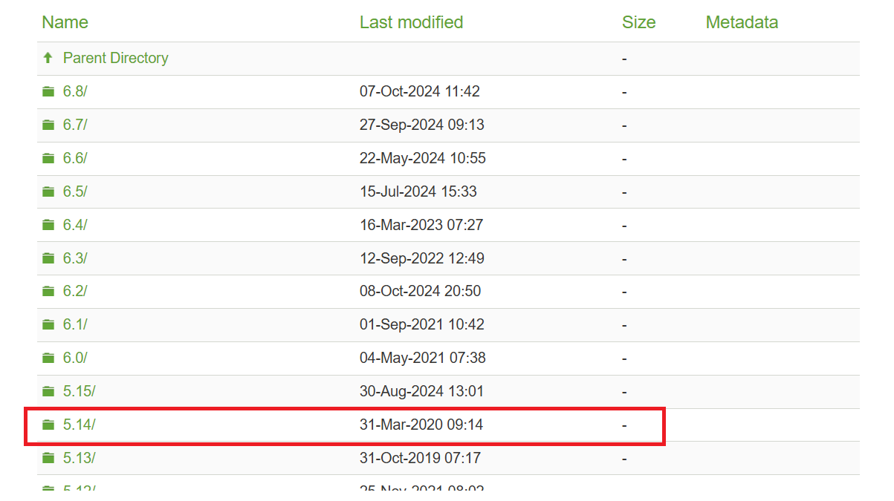

   小版本选择哪一个都行，这里我选择了5.14.0

   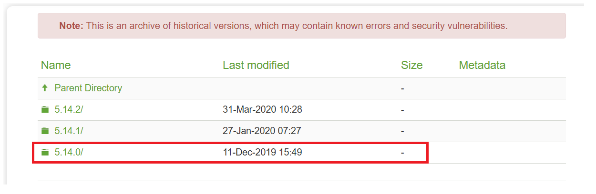

   下载QT SDK

   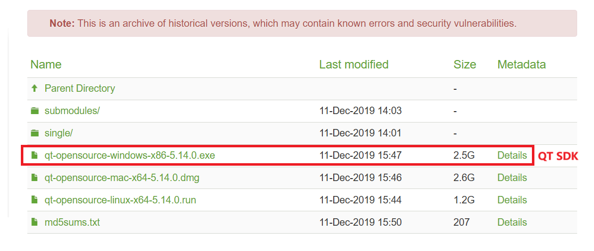

2. 下载好后双击安装

   出现这个可以注册，不想注册关闭网络

   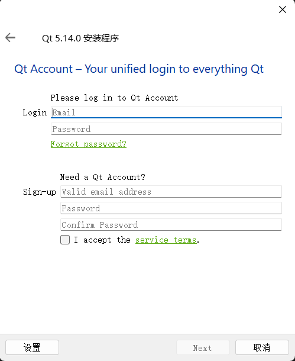

   选择全部组件

   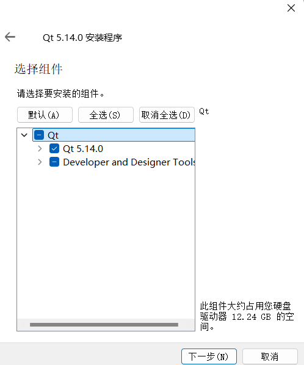

   推荐选择部分组件

   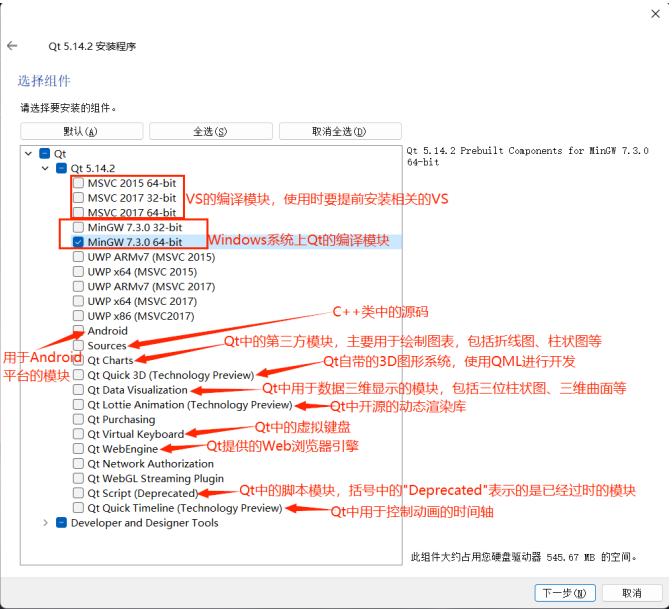

   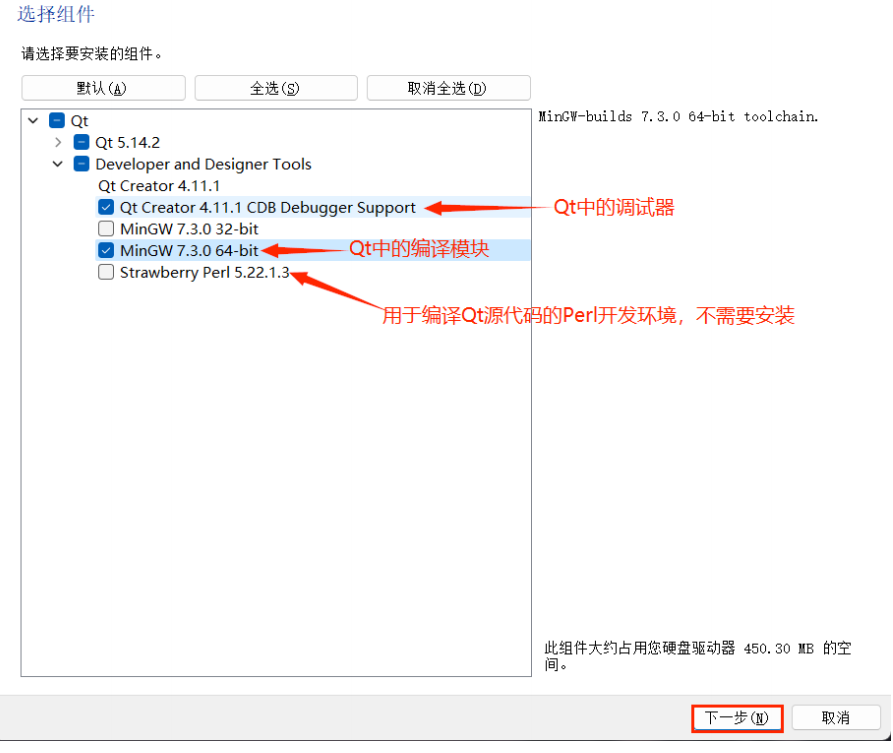

3. 配置环境变量

   `Path`：输入的命令会在 `Path` 环境变量中寻找

   找到下面这个 `bin` 目录，加入 `Path` 中

   ```shell
   G:\software\Qt\5.14.0\mingw73_64\bin
   ```

4. 安装完成

   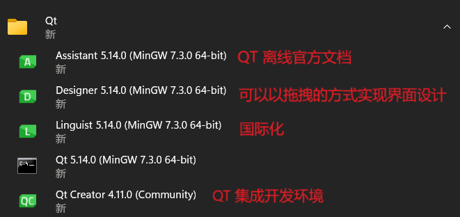

5. 验证

   **创建项目**

   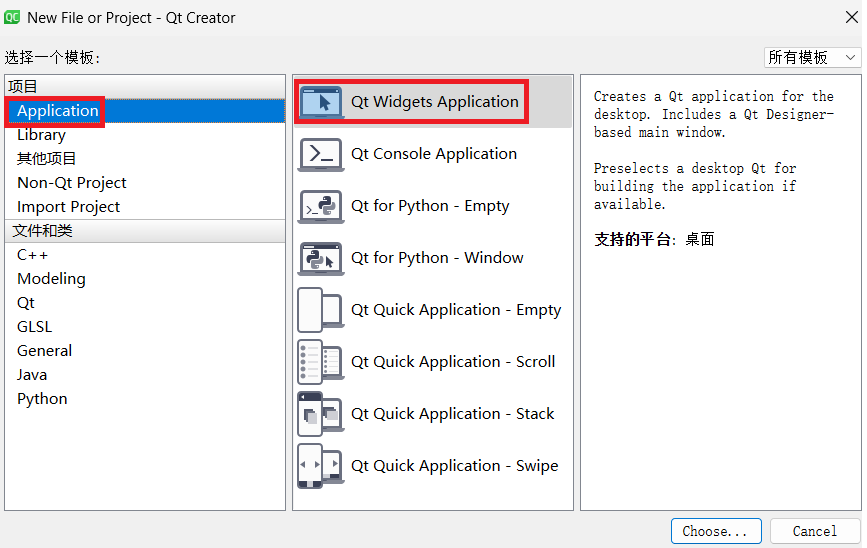**构建系统**

   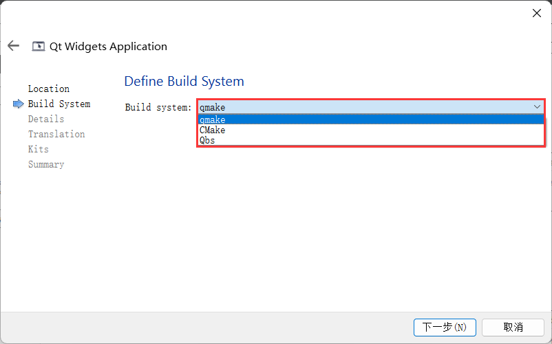

   通过`Qt`写的程序，涉及到一系列“元编程”技术（通过代码来生成代码)。

   `Qt`框架会在编译的时候，先自动调用一系列的生成工具，基于你自己写的代码，生成一系列的其他`C++`代码，最终编译的代码，也就是最后生成的这些代码。

   **类信息**

   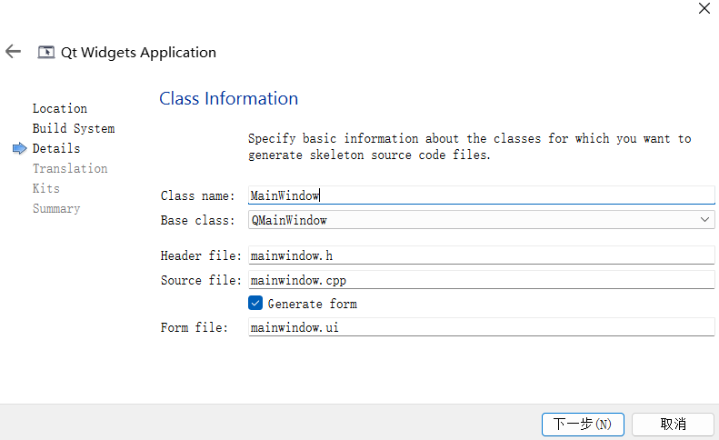

   1. Base class：使用 `QT Creator` 创建项目，会自动地生成一些代码出来，生成的代码就包含一个类。此处就是要选择这个自动生成的类的父类是谁。

      - `QMainWindows`：完整的应用程序窗口（可以包含菜单栏，工具栏，状态栏，……）
      - `QWidget`：表示一个控件（窗口上的一个具体的元素，输入框，按钮，下拉框，单选按钮，复选按钮，……）
      - `QDialog`：表示一个对话框

      这里我们先暂时选择 `QWidget`

   2. `Form file`：`QT` 中创建图形化界面的程序，有两种方式：

      - 直接通过 `C++` 代码的方式创建界面

      - 通过 `Form file`，以图形化的方式来生成界面

        此时，就可以使用 `QT Designer` 或者直接使用 `QT Creator` 来编辑这个 `ui` 文件从而以图形化的方式快速方便的生成图形界面。

   **翻译文件**

   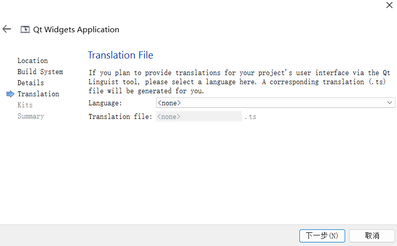

   和国际化相关，暂时不关注

   **选择基于哪个编译器的 `QT SDK` 来构建后续代码**

   选择 `mingw`

   **最后点击构建**

   安装成功：

   

## 4.`QT` 自动生成代码

### 4.1 `main.cpp`

```cpp
#include "widget.h"

#include <QApplication>

int main(int argc, char *argv[]) 
// QT 命令行参数
{
    QApplication a(argc, argv);
    // 编写一个 Qt 图形化界面程序，一定要有一个 QApplication 对象
    Widget w;
    w.show();
    // Widget 刚才在创建项目的时候，填写了生成的类名。此时创建一个控件对象并显示出来
    // Widget 的父类是 QWidget，他提供了以下的方法：
    // .show() 方法让控件显示出来
    // .hide() 方法让控件隐藏
    return a.exec();
    // exec() 表示让程序跑起来（和 Linux 的 exec 没有任何关系）
}
```

### 4.2 `widget.h`

`Widget` 类的声明

```cpp
#ifndef WIDGET_H
#define WIDGET_H
// header guard，保证头文件只被包含一次（#pragma once）
#include <QWidget>

QT_BEGIN_NAMESPACE
namespace Ui { class Widget; }
QT_END_NAMESPACE

class Widget : public QWidget
// QWidget：创建项目时，选择的父类，它是Qt SDK 内置的，要想使用这个类，就需要包含头文件#include <QWidget> 
// Qt中类名和头文件名字相同
{
    Q_OBJECT
    // Qt 内置的宏，展开后会生成一堆代码，如果某个类想使用“信号和槽”，就需要引入这个宏

public:
    Widget(QWidget *parent = nullptr);
    // Qt 中引入了“对象树”机制，创建 Qt 对象，就可以把这个对象挂到树上，挂的时候要指定父节点，这棵树是一个普通的N叉树
    ~Widget();

private:
    Ui::Widget *ui;
    // 和 Form file 密切相关
};
#endif // WIDGET_H
```

### 4.3  `widget.cpp`

```cpp
#include "widget.h"
// 创建项目生成的头文件
#include "ui_widget.h"
// Form file 被 qmake 生成的头文件

Widget::Widget(QWidget *parent)
    : QWidget(parent)
    , ui(new Ui::Widget)
{
    ui->setupUi(this);
    // 把 Form file 生成的界面和当前 widget 关联起来
}

Widget::~Widget()
{
    delete ui;
}
```

`Form file`：

当直接双击 `ui` 文件，此时 `Qt Creator` 就会调用 `Qt Designer`，打开 `ui` 文件，图像化的界面编辑器

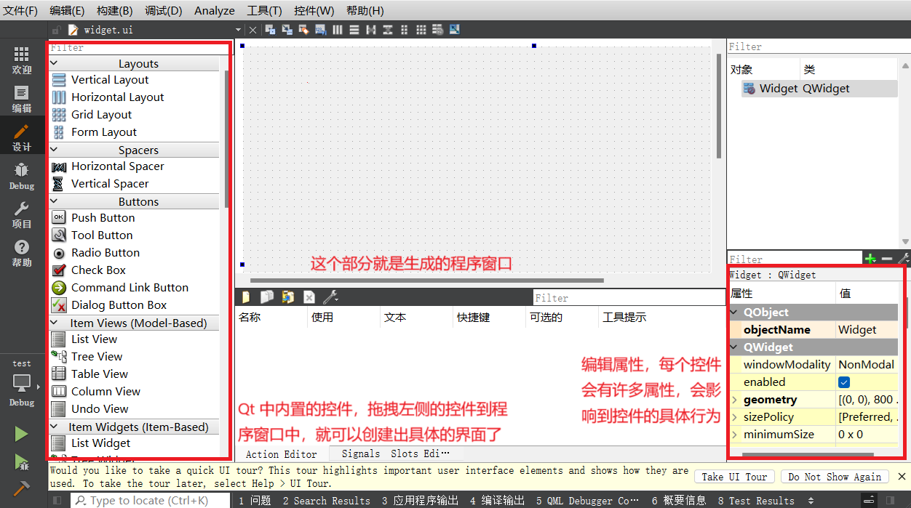

此时再点击左侧边栏的“编辑”按钮，就会显示 `ui` 文件的本体了：

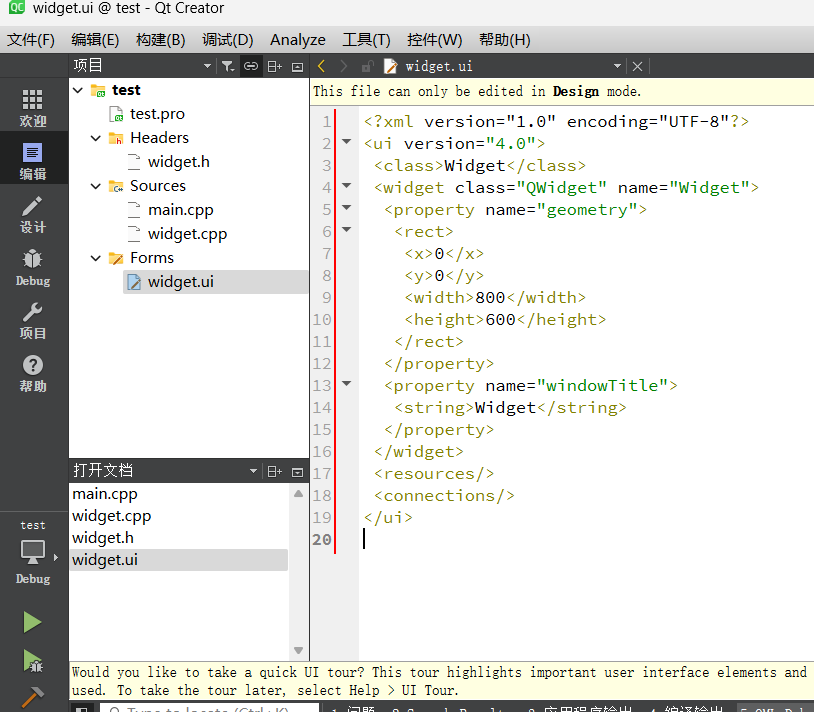

这个格式称为 `xml` 格式，都是以成对/单的标签来表示数据。`xml` 这里的标签，有哪些标签，有什么含义，都是程序员自定义的（`HTML` 的变迁含义是固定的，由标准委员会约定的）。此处看到的标签是开发 `Qt` 的人约定的，我们无需关注。

### 4.4 `.pro` 文件

`Qt` 项目的工程文件，也是 `qmake` 工具构建的时候的重要依据。

类似于 ` makefile`，` qmake`搭配 `.pro` 和 `makefile` 作用类似。

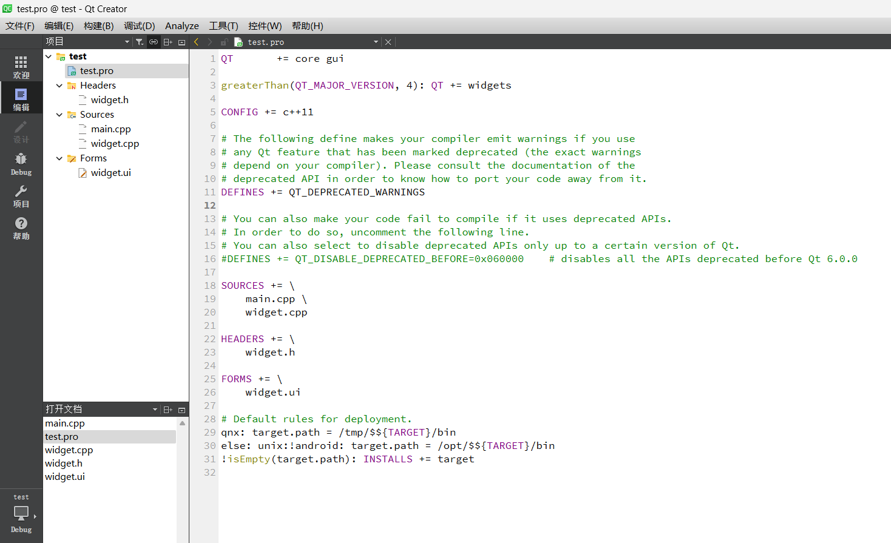

```cpp
QT       += core gui # 要引入的 Qt 模块，后面可能会修改
    
greaterThan(QT_MAJOR_VERSION, 4): QT += widgets

CONFIG += c++11

# The following define makes your compiler emit warnings if you use
# any Qt feature that has been marked deprecated (the exact warnings
# depend on your compiler). Please consult the documentation of the
# deprecated API in order to know how to port your code away from it.
DEFINES += QT_DEPRECATED_WARNINGS

# You can also make your code fail to compile if it uses deprecated APIs.
# In order to do so, uncomment the following line.
# You can also select to disable deprecated APIs only up to a certain version of Qt.
#DEFINES += QT_DISABLE_DEPRECATED_BEFORE=0x060000    # disables all the APIs deprecated before Qt 6.0.0

// 描述了当前项目中，参与构建的文件有什么（编译器要编译哪些文件），不需要手动修改，Qt Creator 会自动维护好
SOURCES += \
    main.cpp \
    widget.cpp

HEADERS += \
    widget.h

FORMS += \
    widget.ui

# Default rules for deployment.
qnx: target.path = /tmp/$${TARGET}/bin
else: unix:!android: target.path = /opt/$${TARGET}/bin
!isEmpty(target.path): INSTALLS += target
```

### 4.5 临时文件

在运行一次程序后，会在项目目录并列的地方，多出来一个 `build-xxxxx` 目录，这个目录里面就是该项目运行过程中，生成的一些临时文件。

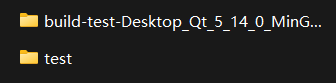

编译 Qt 程序，还是会用到 `makefile`，只不过这个 `makefile` 不需要手写，而是 `qmake` 自动生成的。

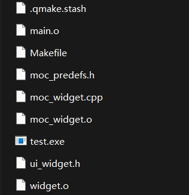

`widget.ui`：`xml` 生成的 `.h` 文件

Qt 自动生成的代码，会在 `setupUi` 中，生成出界面的具体细节

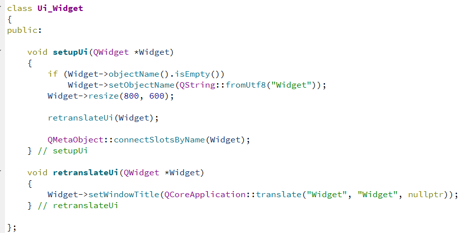