# 二、初始 `Qt`

## 1.实现 `hello world`

两种方式，实现 `hello world`

1. 通过图形化的方式，在界面上创建出一个控件，显示 `hello world`
2. 通过纯代码的方式，通过编写代码，在界面上创建控件，显示 `hello world`

### 1.1 拖拽方式

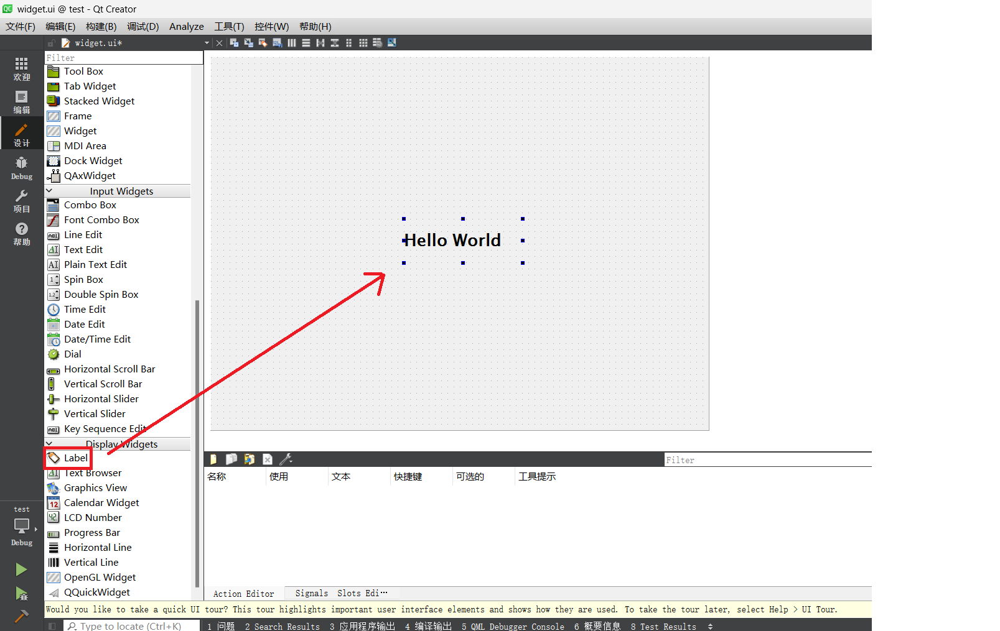

与此同时，`widget.ui` 文件中也会随之改变：

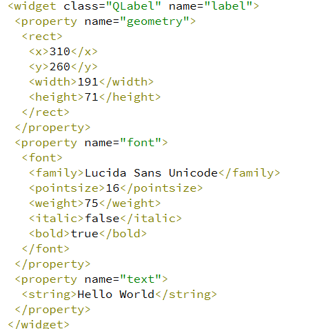

然后 `qmake` 就会在编译项目的时候，基于这个内容生成一段 `C++` 代码，通过代码构建出界面。

### 1.2 代码方式

一般通过代码来构造界面时，通常我们会把构造界面的代码放到 `Widget/MainWindow` 的构造函数中

`Qt` 中每个类都有一个对应同名头文件

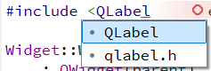

- `QLabel` 是现在的Qt头文件风格
- `qlabel.h` 是上古时期的 `Qt` 头文件风格

```cpp
#include "widget.h"
#include "ui_widget.h"
#include <QLabel>

Widget::Widget(QWidget *parent)
    : QWidget(parent)
    , ui(new Ui::Widget)
{
    ui->setupUi(this);

    // 更推荐这种在堆上创建的方式
    // this: 给当前这个 label 对象，指定一个“父对象”，this 是 main 函数中的 Widget w;
    QLabel* label = new QLabel(this);
    // 栈上创建也行
    // QLabel label(this);

    // Qt 诞生于1991年，C++还没形成标准，更没有标准库这种东西
    // 当时表示一个字符串可以使用C风格的 '\0'(非常难用），也可以使用C++的string（也不好用）
    // Qt 为了让自己的开发能变得顺畅，自己发明了一套轮子
    // 包括但不限于：
    // 字符串：Qstring
    // 动态数组：QVector
    // 链表：QList
    // 字典：QMap
    // ……
    // 现在标准库和Qt包装好的容器类共存
    label->setText("hello world");
    // 在 QString 中也提供了C风格的字符串作为参数的构造函数
    // 不显示构造 Qstring，上述代码中，C风格字符串也会隐式构造成 Qstring 对象
}

Widget::~Widget()
{
    delete ui;
}
```

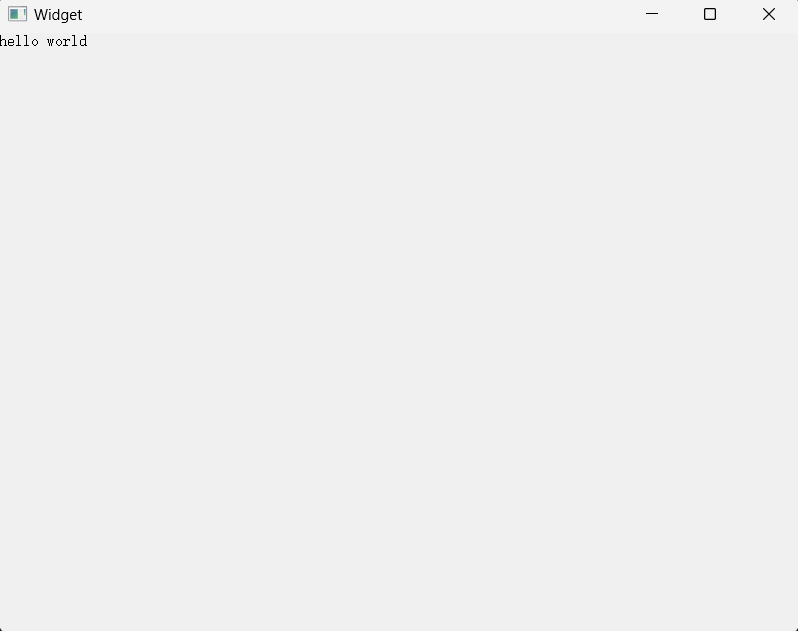

但是这个代码，`new` 了对象之后，为什么没有 `delete`，不会内存泄漏吗？

**不会！**会在合适的时候（**窗口关闭/销毁**）被析构释放。

前端网页开发也涉及类似的对象树（DOM），把界面上的各种元素组织起来了。

栈上创建可能会有”提前释放“的问题，`hello world` 无法显示出来：

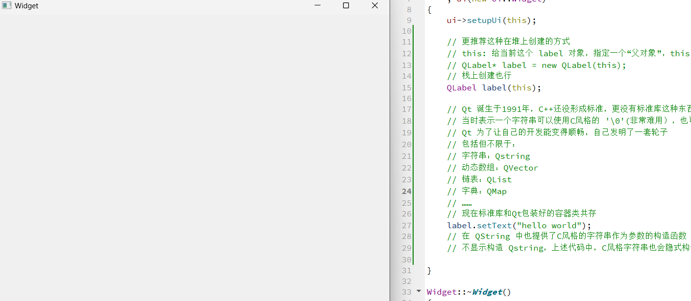

### 1.3 输入框方式

使用编辑框来完成 `hello world`

1. 单行边界框：`QLineEdit`
2. 多行编辑框：`QTextEdit`

拖拽：

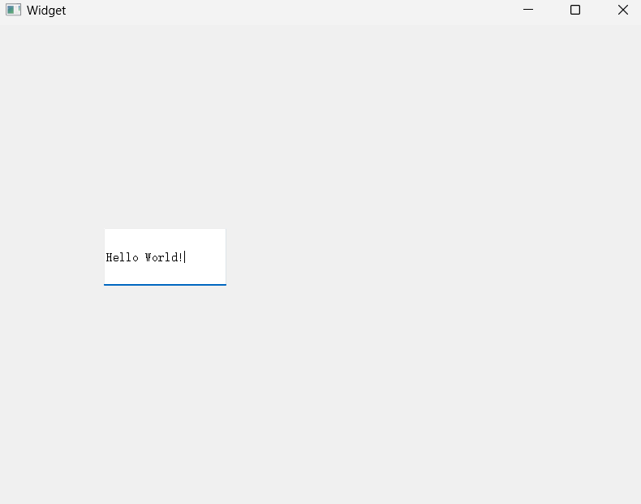

纯代码：

```cpp
#include "widget.h"
#include "ui_widget.h"
#include <QLineEdit>
Widget::Widget(QWidget *parent)
    : QWidget(parent)
    , ui(new Ui::Widget)
{
    ui->setupUi(this);

    QLineEdit* edit = new QLineEdit(this);
    edit->setText("Hello World!");
}

Widget::~Widget()
{
    delete ui;
}
```

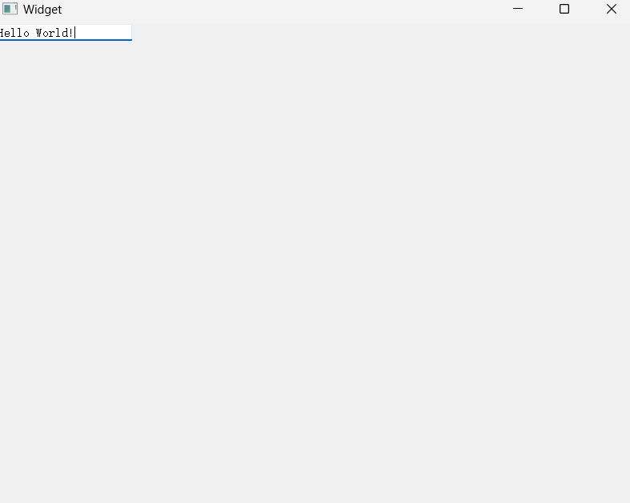

### 1.4 按钮方式

`Push Button` 按钮

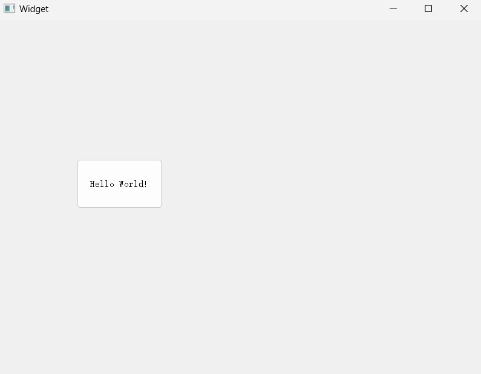

怎么让按钮点击之后有效果？信号槽机制！

本质就是给按钮的点击操作，关联上一个处理函数，当用户点击的时候，就会执行这个处理函数。

`Qt` 中的 `connect` 是`QObject` 这个类提供的静态函数，这个函数的作用是链接”信号“和”槽“

```cpp
connect(ui->pushButton, // 谁发出的信号 
&QPushButton::clicked,  // 发出了个啥信号（点击按钮时会自动触发这个信号）
this, 					// 谁来处理这个信号
&Widget::handleClick    // 具体怎么处理
);
```

`ui->pushButton` 访问到 `Form file` （`ui` 文件中创建的控件），在 `Qt Creator` 中创建一个控件的时候，就会给这个控件分配一个 `objectName` 的属性，这个属性的值必须时唯一的。

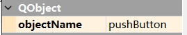

拖拽后会自动生成一个，也可以手动修改。

`qmake` 在预处理 `ui` 文件的时候就会根据这里的 `objectName` 生成对应的 `C++` 代码

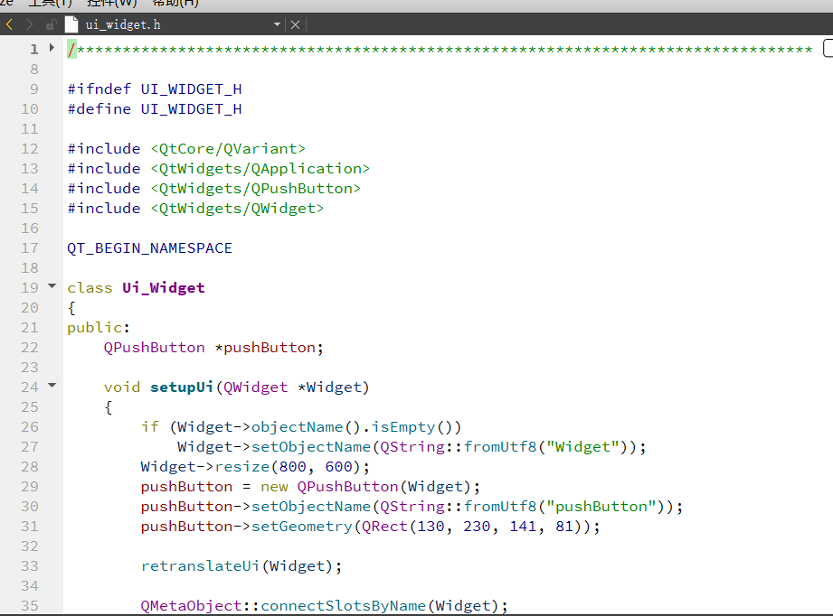

## 2.乱码问题

一个汉字多少字节？

- `GBK`：2字节

  `Windows` 默认

- `UTF-8`：一般是3字节

  `Linux` 默认

Qt 中直接 `cout` 会乱码

乱码：编码方式不匹配！

字符串编码方式和终端解析方式不一致

解决方式：

`QString` 可以帮助我们自动的处理编码方式

`Qt` 也提供了专门用来打印日志的工具，也能自动处理编码

```cpp
#include <QDebug>

qDebug() << "hello!";
// qDebug() 这个宏封装了 QDebug 对象，直接使用 qDebug(), 这个东西可以当作 cout 使用

// qDebug() 还可以通过编译开关，统一进行关闭
```

## 3.变量命名风格

- 类名：大驼峰
- 函数名及变量名：小驼峰

## 4.查询文档

打开帮助⽂档有三种⽅式。实际编程中使⽤哪种都可以。

1. 光标放到要查询的类名/⽅法名上，直接按 `F1`
2. `Qt Creator` 左侧边栏中直接⽤⿏标单击 "帮助" 按钮
3. 找到 `Qt Creator` 的安装路径，在 `bin` ⽂件夹下找到 `assistant.exe`，双击打开

## 5.坐标系

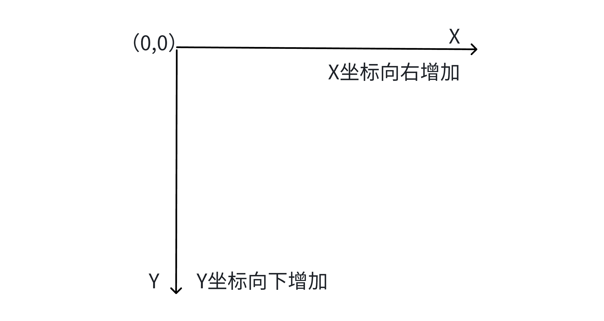

对于嵌套窗⼝，其坐标是相对于⽗窗⼝来说的。

`move` 函数设置位置：

```cpp
button->move(200, 300);
```

