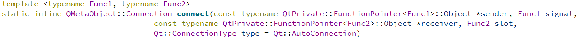
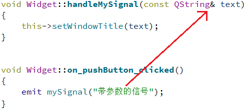
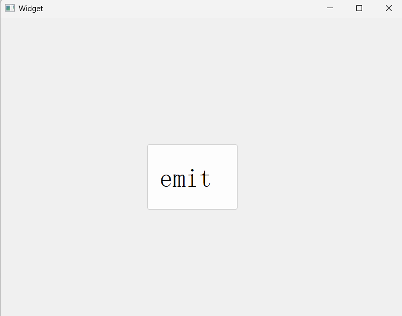
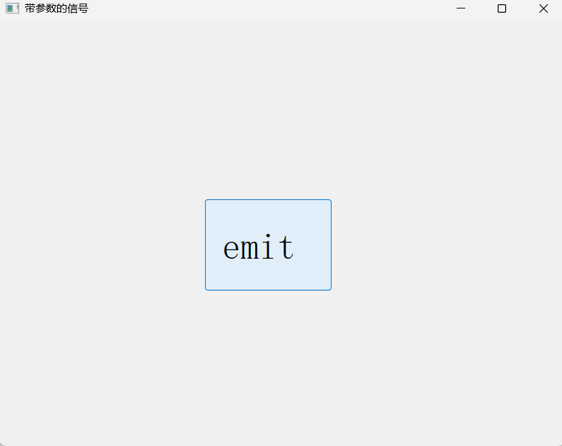

# 三、信号和槽

## 1.信号和槽概述

###  信号涉及的三个要素

1. 信号源：由哪个控件发出的信号

2. 信号的类型：用户进行不同的操作，就可能触发不同的信号（点击按钮，触发点击信号；在输入框中移动光标，触发移动光标的信号；勾选一个复选框；选择一个下拉框）

3. 信号的处理方式：槽 $\rightarrow$ 函数

   `Qt` 中可以使用 `connect` 这样的函数，把一个信号和一个槽关联起来，后续只要信号触发了，`Qt` 就会自动执行槽函数

   所谓的“槽函数”，本质上也时一种“回调函数”

**一定时先把信号的处理方式准备好，再触发信号**

Qt 中先关联信号和槽，再触发这个信号

## 2.信号和槽的使用

### 2.1 连接信号和槽

在 `Qt` 中，`QObject` 类（`QObject` 是 `Qt` 内置的⽗类，`Qt` 中提供的很多类都是直接或者间接继承自`QObject`）提供了⼀个静态成员函数`connect()` ，该函数专门⽤来关联指定的信号函数和槽函数。

```cpp
connect (const QObject *sender, 				 // 描述了当前信号时哪个控件发出来的
    const char * signal, 					     // 信号的类型
    const QObject * receiver,  					 // 哪个对象负责处理
    const char * method, 						 // 怎么处理
    Qt::ConnectionType type = Qt::AutoConnection // 很少使用，暂时不考虑
)
```

所谓信号，也是Qt对象内部提供的一些成员函数

这是老版本 `Qt` 的声明方式，使用的时候要搭配宏把函数指针转成 `char*`：

```cpp
connect(button, SINGAL(&QPushButton::clicked), this, SLOT(&Widget::close))
```

但是这样未免太繁琐，从 `Qt5` 开始，`connect` 函数提供了重载版本，第二个参数和第四个参数成了泛型参数，允许传入任意类型的函数指针了：



此时 `connect` 函数就带有了一定的**参数检查**功能了，如果你传入的第一个参数和第二个参数不匹配，或者第三个参数和第四个参数不匹配（2、4参数的函数指针，不是1、3参数的成员函数），此时代码编译出错。

代码示例：

界面上包含一个按钮，用户点击按钮，则关闭窗口

```cpp
#include "widget.h"
#include "ui_widget.h"
#include <QPushButton>

Widget::Widget(QWidget *parent)
    : QWidget(parent)
    , ui(new Ui::Widget)
{
    ui->setupUi(this);
    QPushButton* button = new QPushButton(this);
    button->setText("关闭");
    button->move(200, 300);

    connect(button,
        // click 在调用的时候相当于点击了一下按钮，是一个槽函数
        // clicked 点完了才触发点击信号，是一个信号函数
        &QPushButton::clicked,
        //前两个参数必须匹配，button 的类型如果时 QPushButton*
        // 此时第二个参数的信号就必须是 QPushButton 内置（或父类）的信号
        this,
        &Widget::close
    );
}

Widget::~Widget()
{
    delete ui;
}
```

### 2.2 自定义信号和自定义槽

#### 2.2.1 自定义槽

**槽** 其实是一个普通的成员函数

- 纯代码方式实现

  以下代码实现了自定义槽函数，达到按下按钮，修改窗口标题的效果：

  ```cpp
  // widget.h
  #ifndef WIDGET_H
  #define WIDGET_H
  
  #include <QWidget>
  
  QT_BEGIN_NAMESPACE
  namespace Ui { class Widget; }
  QT_END_NAMESPACE
  
  class Widget : public QWidget
  {
      Q_OBJECT
  
  public:
      Widget(QWidget *parent = nullptr);
      ~Widget();
  
      void handleClicked();
  
  private:
      Ui::Widget *ui;
  };
  #endif // WIDGET_H
  
  // widget.cpp
  #include "widget.h"
  #include "ui_widget.h"
  #include <QPushButton>
  Widget::Widget(QWidget *parent)
      : QWidget(parent)
      , ui(new Ui::Widget)
  {
      ui->setupUi(this);
  
      QPushButton* button = new QPushButton(this);
      button->setText("按钮");
      button->move(100, 100);
      connect(button, &QPushButton::clicked, this, &Widget::handleClicked);
  }
  
  Widget::~Widget()
  {
      delete ui;
  }
  
  void Widget::handleClicked()
  {
      // 按下按钮，修改窗口标题
      this->setWindowTitle("按钮已经按下");
  }
  ```

  在以前版本的 Qt 中，槽函数必须放到

  ```cpp
  public/private/protected slots;
  ```

  此处的 `slots` 是 Qt 自己扩展的关键字

  Qt 里广泛使用了**元编程**技术，也就是基于代码生成代码。`qmake` 构建 Qt 项目的时候，就会调用专门的扫描器，扫描代码中的特定关键字（`slots` 这种），基于关键字自动生成一大堆相关的代码。

- 图形化方式实现

  在 `ui` 文件中，拖拽一个按钮，右键点击按钮，转到槽，选择槽函数，这时 Qt 自动帮我们生成好了相关函数，我们在函数内部编写逻辑即可。

  ```cpp
  // 自动生成
  void Widget::on_pushButton_clicked()
  {
  	// 编写逻辑
      this->setWindowTitle("按钮已被点");
  }
  ```

  在 Qt 中，除了通过 `connect` 来连接信号槽之外，还可以通过函数名字自动连接。

  `on_pushButton_clicked` 中，`on` 是固定前缀，`pushButton` 是按钮的 `objectName`（按钮的身份表示，通过 `ui->pushButton` 获取），`clicked` 是信号的名字。**当函数名符合上述规则之后，Qt 就能自动把信号和槽建立上联系。** 这个联系是由 `ui_widget.h` 中的 `connectSlotsByName` 函数完成。

  总之，如果是用代码方式，推荐手动 `connect`；如果是图形化的方式，推荐这种自动的快速方式。

#### 2.2.2 自定义信号

自定义槽函数非常关键，开发中大部分情况都是需要自定义槽函数的；自定义信号比较少见，实际开发中很少会需要。因为信号对应到的某个操作，用户能够进行哪些操作，是可以穷举的。

`QWidget` 虽然没有定义任何信号，但由于它继承自 `QWidget` 和 `QObject`，这两类里面已经提供了一些信号了，可以直接使用。

Qt 的信号，本质上就是一个函数，它是一类非常特殊的函数。

1. 程序员只要写出函数声明，并且告诉 Qt，这是一个信号即可。这个函数的定义，是 Qt 在编译的过程中自动生成的，程序员无法干预；
2. 作为信号函数，返回值必须是 `void`，有没有参数都可以，甚至可以支持重载。
3. signals：这个也是 Qt 自己扩展出来的关键字
4. Qt 内置的信号，不需要手动通过代码来触发，用户在 GUI 进行某些操作，就会自动触发对应信号（发射信号的代码已经内置到 Qt 框架中了）
5. emit：发射信号 `emit mySignal();`

```cpp
// widget.h
#ifndef WIDGET_H
#define WIDGET_H

#include <QWidget>

QT_BEGIN_NAMESPACE
namespace Ui { class Widget; }
QT_END_NAMESPACE

class Widget : public QWidget
{
    Q_OBJECT

public:
    Widget(QWidget *parent = nullptr);
    ~Widget();

    void handleMySignal();

signals:
    void mySignal();

private slots:
    void on_pushButton_clicked();

private:
    Ui::Widget *ui;
};
#endif // WIDGET_H

// widget.cpp
#include "widget.h"
#include "ui_widget.h"

Widget::Widget(QWidget *parent)
    : QWidget(parent)
    , ui(new Ui::Widget)
{
    ui->setupUi(this);

    connect(this, &Widget::mySignal, this, &Widget::handleMySignal);
}

Widget::~Widget()
{
    delete ui;
}

void Widget::handleMySignal()
{
    this->setWindowTitle("处理自定义信号");
}


void Widget::on_pushButton_clicked()
{
    // 点按钮的时候发射信号
    // Qt5 可以省略 emit
    // 此外 emit 还可以发射内置信号
    emit mySignal();
}
```

### 2.3 信号和槽也可以带参数

当信号带有参数的时候，槽的参数必须和信号的参数一致。此时发射信号的时候，就可以给信号函数传递实参，与之对应的这个参数就会被传递到对应的槽函数中。此时就可以起到让信号给槽传参的效果了。

这里的参数必须要一致，一致主要是要求类型，个数不一致也可以，但信号的参数个数必须比槽的参数个数多：


让信号给槽传参：



效果如下：

<table>
    <tr>
        <td></td>
        <td></td>
    </tr>
</table>

**为什么信号函数的参数个数可以比槽函数的参数个数多？**

因为一个槽函数有可能绑定多个信号，如果我们严格要求参数个数一致，就意味着信号绑定到槽的要求变高了。这样有更多的信号可以绑定到这个槽上面了。

总结来说，带参数的信号和槽，要求**类型一致**，个数满足 $\textbf{信号函数的参数}\ge \textbf{槽函数的参数}$，

### 2.4 信号和槽的注意事项

Qt 中如果要让某个类能够使用信号槽，则必须在类最开始的地方写下 Q_OBJECT 宏，这个宏能展开很多额外的代码。

### 2.5 信号和槽存在的意义

信号和槽要解决的问题，其实就是响应用户的操作。信号和槽，在 GUI 开发的各种框架中，是一个比较有特色的（高情商的说法，低情商：比较复杂）存在，其他 GUI 开发框架，搞的方式都要更加简洁。

比如网页开发（js + dom api），响应用户操作，主要是挂载回调函数，不需要搞一个单独的 connect 完成上述信号和槽的连接。

Qt 为什么搞信号和槽：

- 解耦合：把触发用户操作的控件和处理对应用户的操作逻辑解耦合

- **实现”多对多“效果**：

  - 一个信号可以 connect 到多个槽函数上
  - 一个槽函数也可以被多个信号 connect

  这和数据库中的“多对多”非常相似：一个学生可以选多个课程，一个课程里可以有多个学生。引入关联表（选课记录表）来关联两张表。Qt 中的 connect 就相当于这个关联表。

但是实际开发中很少有“多对多”的需求，绝大部分情况，”一对一“就够用了

## 3.信号和槽的断开

使用 disconnect 来断开信号和槽的连接，这个操作用的比较少，大部分情况下，把信号和槽连上后，就不必管了。主动断开往往是把信号重新绑定到另一个槽函数上。

```c++
// .h
#ifndef WIDGET_H
#define WIDGET_H

#include <QWidget>

QT_BEGIN_NAMESPACE
namespace Ui { class Widget; }
QT_END_NAMESPACE

class Widget : public QWidget
{
    Q_OBJECT

public:
    Widget(QWidget *parent = nullptr);
    ~Widget();

    void handleclick();
    void handleclick2();

private slots:
    void on_pushButton_2_clicked();

private:
    Ui::Widget *ui;
};
#endif // WIDGET_H

// .cpp
#include "widget.h"
#include "ui_widget.h"

Widget::Widget(QWidget *parent)
    : QWidget(parent)
    , ui(new Ui::Widget)
{
    ui->setupUi(this);
    connect(ui->pushButton, &QPushButton::clicked, this, &Widget::handleclick);
}

Widget::~Widget()
{
    delete ui;
}

void Widget::handleclick()
{
    this->setWindowTitle("修改窗口标题");
}

void Widget::handleclick2()
{
    this->setWindowTitle("修改窗口标题2");
}

void Widget::on_pushButton_2_clicked()
{
    // 1.先断开原来的信号槽
    disconnect(ui->pushButton, &QPushButton::clicked, this, &Widget::handleclick);
    // 2.重新绑定信号槽
    connect(ui->pushButton, &QPushButton::clicked, this, &Widget::handleclick2);
}
```

## 4.使用 lambda 表达式定义槽函数

lambda 表达式是一个语法糖，很多语言都支持。本质就是一个匿名函数，主要应用在回调函数场景中，且是一次性使用。

lambda 表达式是一个回调函数，这个函数是无法直接获取到上层作用域中的变量的，为了解决上述问题，引入了 **变量捕获** 的语法。

```cpp
#include "widget.h"
#include "ui_widget.h"
#include <QPushButton>
#include <QDebug>

Widget::Widget(QWidget *parent)
    : QWidget(parent)
    , ui(new Ui::Widget)
{
    ui->setupUi(this);
    QPushButton* button = new QPushButton(this);
    button->setText("按钮");
    button->move(200, 200);

    connect(button, &QPushButton::clicked, this, [button](){
        qDebug() << "lambda 被执行了！";
        button->move(300, 300);
    });
}

Widget::~Widget()
{
    delete ui;
}
```

