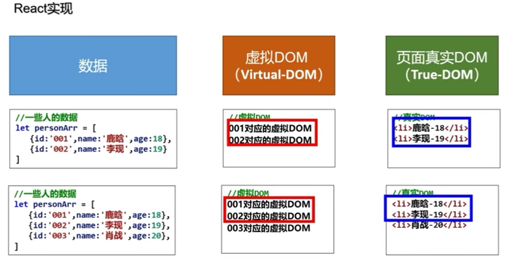
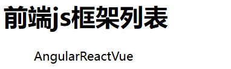

# react 入门

## 一、react 简介

### 1.React 是什么

`react` 是一个将数据渲染为 `HTML` 视图的开源`JavaScript` 库。

### 2.谁开发的

由 `Facebook` 开发，且开源。

### 3.为什么要学

1. 原生 `JavaScript` 操作 `DOM` 繁琐、效率低
2. 使用 `JavaScript` 直接操作 `DOM` ，浏览器会进行大量的重绘重排
3. 原生 `JavaScript` 没有组件化的编码方案，代码复用率低

### 4.React 的特点

1. 采用组件化模式，声明式编码，提高开发效率及组件服用率
2. 在 `React Native` 中可以使用 `React` 语法进行移动端开发
3. 使用虚拟 `DOM` + 优秀的 `Diffing` 算法，尽量减少与真实 `DOM` 的交互



## 二、react 的基本使用

### 1.相关 js 库

1. react.js：react 核心库
2. react-dom.js：提供操作 DOM 的 react 扩展库
3. babel.min.js：解析 JSX 语法代码转为 JS 代码的库

**引入时有顺序要求，必须先引入核心库，再引入扩展库**

```html
<!-- 引入react核心库 -->
<script type="text/javascript" src="../js/react.development.js"></script>
<!-- 引入react-dom，用于支持react操作DOM -->
<script type="text/javascript" src="../js/react-dom.development.js"></script>
<!-- 引入babel，用于将jsx转为js -->
<script type="text/javascript" src="../js/babel.min.js"></script>
```

### 2.创建虚拟 DOM 的两种方式

#### 2.1 纯 JS 方式

一般不用，因为如果标签内容里包含标签，需要再用 createElement 创建，比较麻烦：

```html
<body>
    <!-- 准备好一个“容器” -->
    <div id="test"></div>

    <!-- 引入react核心库 -->
    <script type="text/javascript" src="../js/react.development.js"></script>
    <!-- 引入react-dom，用于支持react操作DOM -->
    <script type="text/javascript" src="../js/react-dom.development.js"></script>

    <script type="text/javascript" > 
        // 1.创建虚拟DOM
        // createElement用于创建虚拟DOM，参数如下：(标签名, 标签属性, 标签内容)
        const VDOM = React.createElement('h1',{id:'title'},React.createElement('span',{},'Hello,React'))
        // 2.渲染虚拟DOM到页面
        ReactDOM.render(VDOM,document.getElementById('test'))
    </script>
</body>
```

#### 2.2 JSX 方式

JSX 方式可以直接解析标签，就像写 HTML 一样：

```html
<script type="text/babel" > /* 此处一定要写babel */
	// 1.创建虚拟DOM
	const VDOM = (  /* 此处一定不要写引号，因为不是字符串 */
		<h1 id="title">
			<span>Hello,React</span>
    	</h1>
	)
	// 2.渲染虚拟DOM到页面
	ReactDOM.render(VDOM,document.getElementById('test'))
</script>
<!-- render 接收两个参数 render(虚拟DOM, 容器) -->
```

打开后效果如下：


```html
<script type="text/babel">
    const VDOM1 = <h1>Hello, React</h1> 
    const VDOM2 = <h1>Hello, ahwei</h1>

    ReactDOM.render(VDOM1, document.getElementById('test'))
    ReactDOM.render(VDOM2, document.getElementById('test'))
</script>
```

此时页面如下：


因为这是一个替换的操作，而非追加。

### 3.虚拟DOM与真实DOM

关于虚拟DOM：

1. 本质是Object类型的对象（一般对象）
2. 虚拟DOM比较“轻”，真实DOM比较“重”，因为虚拟DOM是React内部在用，无需真实DOM上那么多的属性。
3. React 提供了一些 API 来创建一种“特别”的一般 js对象
   - <span style="color: blue;">const</span> <span style="color: SteelBlue">VDOM</span> = <span style="color: DarkBlue">React</span>.<span style="color: DarkGoldenRod">createElement</span>(<span style="color: FireBrick">'xx'</span>, {<span style="color: DarkBlue">id: </span><span style="color: FireBrick">'xx'</span>}, <span style="color: FireBrick">'xx'</span>)
   - 上面创建的就是一个简单的虚拟DOM对象 
4. 虚拟 DOM 对象最终都会被 React 转换为真实的 DOM
5. 我们编码时基本只需要操作 react 的虚拟 DOM 相关数据，react 会转换为真实 DOM 变化而更新

## 三、react jsx

jsx语法规则：

1. 定义虚拟DOM时，不要写引号。

2. 标签中混入JS表达式时要用{}。

   ```html
   const myId = 'aTgUiGu'
   const myData = 'HeLlo,rEaCt'
   const VDOM = (
       <h2 className="title" id={myId.toLowerCase()}>
           <span>
               {myData.toLowerCase()}
           </span>
       </h2>
   )
   ```

3. 样式的类名指定不要用class，要用className

   因为 ES6 中引入了关键字 class

4. 内联样式，要用 style={{key:value}} 的形式去写

   ```html
   <h2 className="title" id={myId.toLowerCase()}>
       <span style={{color:'white',fontSize:'29px'}}>{myData.toLowerCase()}</span>
   </h2>
   ```

   而且要使用小驼峰，就像 fontSize 一样

5. 只有一个根标签

   多个根标签直接报错：

   

   正确的写法是再套一个 div：

   ```html
   <div>
       <h2 className="title" id={myId.toLowerCase()}>
           <span style={{color:'white',fontSize:'29px'}}>{myData.toLowerCase()}</span>
       </h2>
       <h2 className="title" id={myId.toUpperCase()}>
           <span style={{color:'white',fontSize:'29px'}}>{myData.toLowerCase()}</span>
       </h2>
   </div>
   ```

6. 标签必须闭合

   就算是单标签，也要闭合，例如 input 标签：

   ```html
   <input type="text"/>
   ```

   否则报错：

   

7. 标签首字母

   - 若小写字母开头，则将该标签转为 html 中同名元素，若 html 中无该标签对应的同名元素，则报错。

     

   - 若大写字母开头，react 就去渲染对应的组件，若组件没有定义，则报错。

     

**练习：**

- react 可以自动遍历数组，但是无法遍历对象

  ```react
  // 模拟一些数据
  const data = ['Angular', 'React', 'Vue']
  
  // 1.创建虚拟DOM
  const VDOM = (
      <div>
          <h1>前端js框架列表</h1>
          <ul>
              {data}
          </ul>
      </div>
  )
  // 2.渲染虚拟DOM到页面
  ReactDOM.render(VDOM, document.getElementById('test'))
  ```

  

  ```react
  //模拟一些数据
  const obj = {name: "ahwei", sex: "male"}
  //1.创建虚拟DOM
  const VDOM = (
      <div>
          <h1>前端js框架列表</h1>
          <ul>
              {obj}
          </ul>
      </div>
  )
  //2.渲染虚拟DOM到页面
  ReactDOM.render(VDOM, document.getElementById('test'))
  ```

  

- 纯数据加工成带有标签的数据：

  ```react
  //模拟一些数据
  const data = ['Angular','React','Vue']
  //1.创建虚拟DOM
  const VDOM = (
      <div>
          <h1>前端js框架列表</h1>
          <ul>
              {
                  /* 这里必须放 js 表达式，而非语句  		
  			       一定注意区分：【js语句(代码)】与【js表达式】
  				   1.表达式：一个表达式会产生一个值，可以放在任何一个需要值的地方
  						下面这些都是表达式：
  							(1). a
  							(2). a+b
  							(3). demo(1)
  							(4). arr.map() 
  							(5). function test () {}
  				   2.语句(代码)：
  						下面这些都是语句(代码)：
  							(1).if(){}
  							(2).for(){}
  							(3).switch() { case:xxxx }
  				*/
                  data.map((item)=>{
                      return <li>{item}</li>
                  })
              }
          </ul>
      </div>
  )
  //2.渲染虚拟DOM到页面
  ReactDOM.render(VDOM,document.getElementById('test'))
  ```

  

  这个警告是因为 react 框架的 diffing 算法就是靠 key 来实现，所以它必须唯一：

  ```react
  data.map((item, index)=>{
  	return <li key={index}>{item}</li>
  })
  ```

## 四、模块与组件、模块化与组件化

### 1.模块

- 向外提供特定功能的 js 程序，一般就是一个 js 文件
- 为什么要拆成模块：随着业务逻辑增加，代码越来越多且复杂
- 作用：复用 js，简化 js的编写，提高 js 的运行效率

### 2.组件

- 用来实现局部功能效果的代码和资源的集合（html/css/js/image 等等）
- 为什么要用组件：一个界面的功能更复杂
- 作用：复用编码，简化项目编码，提高运行效率

### 3.模块化

当应用的 js 都以模块来编写，这个应用就是一个模块化的应用

### 4.组件化

当应用是以多组件的方式实现，这个应用就是一个组件化的应用
