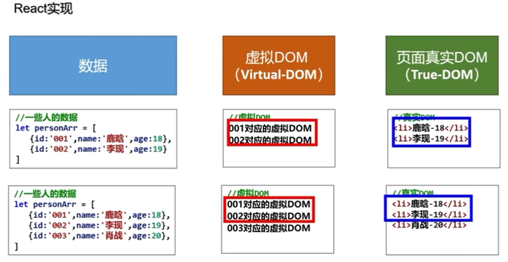

# react 简介

## 一、React 是什么

`react` 是一个将数据渲染为 `HTML` 视图的开源`JavaScript` 库。

## 二、谁开发的

由 `Facebook` 开发，且开源。

## 三、为什么要学

1. 原生 `JavaScript` 操作 `DOM` 繁琐、效率低
2. 使用 `JavaScript` 直接操作 `DOM` ，浏览器会进行大量的重绘重排
3. 原生 `JavaScript` 没有组件化的编码方案，代码复用率低

## 四、React 的特点

1. 采用组件化模式，声明式编码，提高开发效率及组件服用率
2. 在 `React Native` 中可以使用 `React` 语法进行移动端开发
3. 使用虚拟 `DOM` + 优秀的 `Diffing` 算法，尽量减少与真实 `DOM` 的交互

