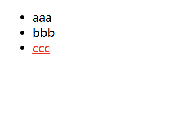
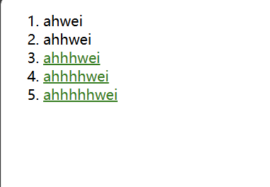
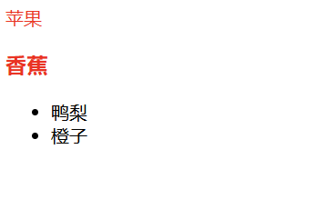
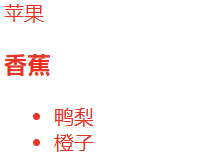
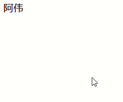
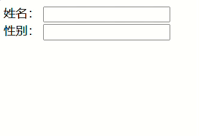

# 选择器

## 一、选择器的功能

选中页面中指定的标签元素（要先选中元素，才能设置元素的属性）

## 二、选择器的种类

[CSS 选择器参考手册](https://www.w3school.com.cn/cssref/css_selectors.asp)

### 1.基础选择器

单个选择器构成的

#### 1.1 标签选择器

- 能快速选择同一类型的标签
- 但是不能差异化选择

```html
<style>
p {
    color: red;
}
div {
    color: green;
}
</style>
<p>阿伟</p>
<p>阿伟</p>
<p>阿伟</p>
<div>温家伟</div>
<div>温家伟</div>
<div>温家伟</div>
```

#### 1.2 类选择器

- 差异化表示不同标签
- 可以让多个标签都使用同一个类

```html
<style>
    .blue {
        color: blue;
    }
</style>

<div class="blue">
    阿伟
</div>
<div>
    阿伟
</div>
```

语法：

- 类名用 `.` 开头
- 下方的标签使用 `class` 属性来调用
- 一个类可以被多个标签使用，一个标签也能使用多个类（多个类名要使用空格分割，这种做法可以让代码更好的复用）
- 如果时长的类名，可以用 `-` 分割
- 不要使用纯数字或者中文以及标签明来命名类名

> [!NOTE]
>
> 一个标签可以同时使用多个类名，这样做可以把相同的属性提取出来，从而达到简化代码的效果。

```html
<style>
    .box {
        width: 200px;
        height: 150px;
    }
    
    .red {
        background-color: red;
    }
    
    .green {
        background-color: green;
    }
</style>
<div class="box red">
    
</div>
<div class="box green">
    
</div>
<div class="box red">
    
</div>
```

#### 1.3 id 选择器

和类选择器类似。

- CSS 中使用 `#` 开头表示 id 选择器
- id 选择器的值和 html 中某个元素的 id 值相同
- html 的元素 id 不必带 `#`
- id 是唯一的，不能被多个标签使用（**和类选择器最大的区别**）

```html
<style>
    #ha {
        color: red;
    }
<\style>
<div id="ha">
    哈哈哈
</div>    
```

> 类比：
>
> - 姓名是类选择器，可以重复
> - 身份证号码是 id 选择器，是唯一的

#### 1.4 通配符选择器

使用 `*` 的定义，选取所有的标签：

```html
* {
	color: red;
}
```

页面的所有内容都会被改成红色。

不需要被页面结构调用。

#### 1.5 总结

|              |         作用         |                 特点                 |
| :----------: | :------------------: | :----------------------------------: |
|  标签选择器  | 能选出所有相同的标签 |            不能差异化选择            |
|   类选择器   | 能选出一个或多个标签 |     根据需求选择，最灵活，最常用     |
|  id 选择器   |    能选出一个标签    | 同一个 id 在一个 html 中只能出现一次 |
| 通配符选择器 |     选择所有标签     |            特殊情况下使用            |

### 2.复合选择器

把多种基础选择器综合运用起来

#### 2.1 后代选择器

又叫包含选择器，选择某个父元素中的某个子元素。

语法：

```html
元素1 元素2 {样式声明}
```

- 元素1和元素2要使用空格分割
- 元素1是父级，元素2是子集，只选择元素2，不影响元素1

把 ol 中的 li 修改颜色，不影响 ul

```html
<ul>
    <li>aaa</li>
    <li>bbb</li>
    <li>ccc</li>
</ul>

<ol>
    <li>ddd</li>
    <li>eee</li>
    <li>fff</li>
</ol>

<style>
	ol li {
        color: red;
    }
</style>
```

元素2不一定非要是儿子，也可以是孙子：

```html
<ul>
    <li>aaa</li>
    <li>bbb</li>
    <li><a href="#">ccc</a></li>
</ul>
<style>
    ul a {
        color: red;
    }
</style>

<!--  
这样也行
<style>
    ul li a {
        color: red;
    }
</style> -->
```

效果如下图所示：



可以是任意基础选择器的组合（包括类选择器、id 选择器）

```html
<ol class="one">
    <li>ahwei</li>
    <li>ahhwei</li>
    <li><a href="#">ahhhwei</a></li>
    <li><a href="#">ahhhhwei</a></li>
    <li><a href="#">ahhhhhwei</a></li>
</ol>
<style>
    .one li a {
        color: green;
    }
</style>
```



#### 2.2 子选择器

和后代选择器类似，但是只能选择子标签。

语法：

```html
元素1>元素2 { 样式声明 }
```

- 使用大于符号分割
- 只选亲儿子，不选孙子

```html
<div class="two">
    <a href="#">链接1</a>
    <p>
        <a href="#">链接2</a>
    </p>
</div>
```

后代选择器会把链接1和链接2都选中：

```html
.two a {
	color: red;
}
```

子选择器的写法，只选择链接1：

```html
.two>a {
	color: red;
}
```

#### 2.3 并集选择器

用于选择多组标签（集体声明）：

```html
元素1, 元素2 { 样式声明 }
```

- 通过逗号分割多个元素
- 表示同时选中元素1和元素2
- 任何基础选择器都可以使用并集选择器
- 并集选择器建议竖着写，每个选择器占一行（最后一个选择器不能加逗号）

```html
<div>苹果</div>
<h3>香蕉</h3>
<ul>
    <li>鸭梨</li>
    <li>橙子</li>
</ul>
```

苹果和香蕉变红：

```html
<style>
    div, h3 {
        color: red;
    }
</style>
```



鸭梨和橙子也一起变红：

```html
<style>
    div, h3, ul>li{
        color: red;
    }
</style>
```



#### 2.4 伪类选择器

##### 2.4.1 链接伪类选择器

- a:link 选择未被访问过的链接
- a:visited 选择已经被访问过的链接
- a:hover 选择鼠标指针悬停上的链接
- a:active 选择活动链接（鼠标按下了但是未弹起）

```html
<a href="#">阿伟</a>
<style>
    a:link {
        color: black;
        /* 去掉 a 标签的下划线 */
        text-decoration: none;
    }

    a:visited {
        color: yellowgreen;
    }

    a:hover {
        color: red;
    }

    a:active {
        color: blue;
    }
</style>
```

效果如下：



> 如何让一个已经被访问过的链接恢复成未访问的状态？
> 清空浏览器历史记录即可：ctrl + shift + delete

**注意：**

- 按照 LVHA（记忆规则 “绿化”） 的顺序书写，例如把 active 拿到前面去，就会导致 active 失效
- 浏览器的 a 标签都有默认样式，一般实际开发都需要单独制定样式
- 实际开发主要给链接做一个样式，然后给 hover 做一个样式即可。link,  visited,  active 用的不多

##### 2.4.2 focus 伪类选择器

focus 伪类适用于**当一个元素进入即将进行交互**的状态。例如，一个输入框获得了焦点。

当我们使用鼠标或类似鼠标设备时，:focus 伪类将在用户开始激活元素后被触发，值得注意的是，元素将保持获得焦点状态，除非用户点击其他的元素。

选取获取焦点的 input 表单元素：

```html
<div class="three">
    姓名：
    <input type="text">
    <br>
    性别：
    <input type="text">
</div>
<style>
    .three>input:focus {
        color: blue;
    }
</style>
```



#### 2.5 总结

| 选择器 | 作用 | 注意事项 |
| :-: | :-: | :-: |
| 后代选择器 | 选择后代元素 | 可以是孙子元素 |
| 子选择器 | 选择子元素 | 只能选亲儿子, 不能选孙子 |
| 并集选择器 | 选择相同样式的元素 | 更好的做到代码重用 |
| 链接伪类选择器 | 选择不同状态的链接 | 重点掌握 `a:hover` 的写法 |
| `focus` 伪类选择器 | 选择被选中的元素 | 重点掌握 `input:focus` |

