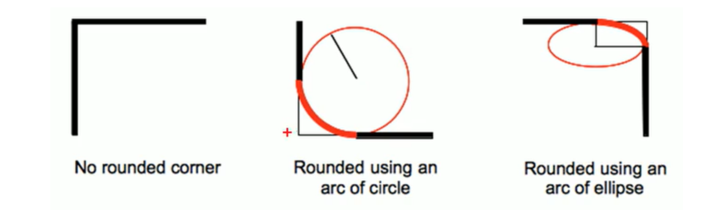
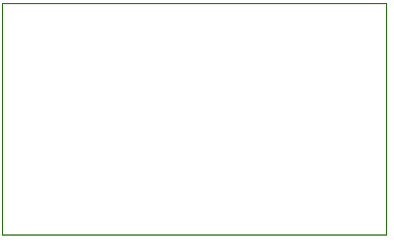
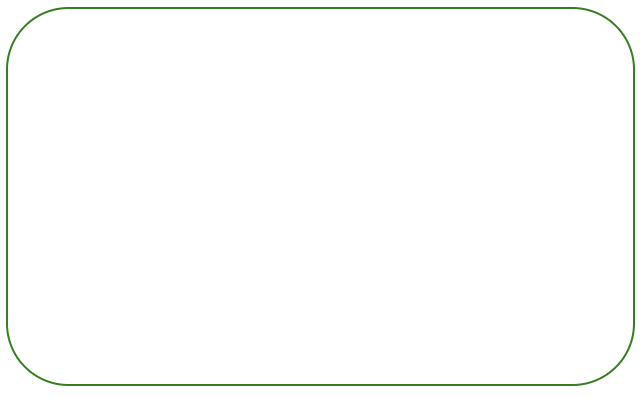
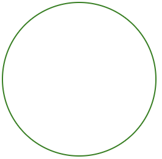
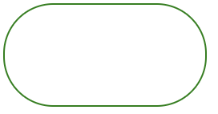

# 圆角矩形

## 一、基本用法

通过 border-radius 使边框带圆角效果。

```css
border-radius: length;
/* length 是内切圆的半径，数值越大，弧线越强烈 */
```



```html
<!DOCTYPE html>
<html lang="en">
<head>
    <meta charset="UTF-8">
    <meta http-equiv="X-UA-Compatible" content="IE=edge">
    <meta name="viewport" content="width=device-width, initial-scale=1.0">
    <title>Document</title>
    <style>
        div {
            width: 500px;
            height: 300px;
            border: 2px green solid;
        }
    </style>
</head>
<body>
    <div>
        
    </div>
</body>
</html>
```

效果如下：



```html
<!DOCTYPE html>
<html lang="en">
<head>
    <meta charset="UTF-8">
    <meta http-equiv="X-UA-Compatible" content="IE=edge">
    <meta name="viewport" content="width=device-width, initial-scale=1.0">
    <title>Document</title>
    <style>
        div {
            width: 500px;
            height: 300px;
            border: 2px green solid;
            border-radius: 50px;
        }
    </style>
</head>
<body>
    <div>
        
    </div>
</body>
</html>
```

加上 border-radius 后效果如下：



## 二、生成圆形

让 border-radius 的值为正方形宽度的一半即可：

```css
div {
    width: 200px;
    height: 200px;
    border: 2px solid green;
    border-radius: 100px;
    /* 或者用 50% 表示宽度的一半 */
    border-radius: 50%;
}
```



## 三、生成圆角矩形

让 border-radius 的值为矩形高度的一半即可：

```css
div {
    width: 200px;
    height: 100px;
    border: 2px solid green;
    border-radius: 50px;
}
```



## 四、展开写法

border-radius 是一个复合写法，实际上可以针对四个角分别设置：

### 1.情况一

```css
border-radius:2em;
```

等价于：

```css
border-top-left-radius:2em;
border-top-right-radius:2em;
border-bottom-right-radius:2em;
border-bottom-left-radius:2em;
```

### 2.情况二

```css
border-radius: 10px 20px 30px 40px;
```

等价于（按顺时针排列）：

```css
border-top-left-radius:10px;
border-top-right-radius:20px;
border-bottom-right-radius:30px;
border-bottom-left-radius:40px;
```

