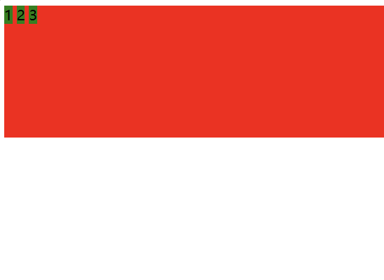
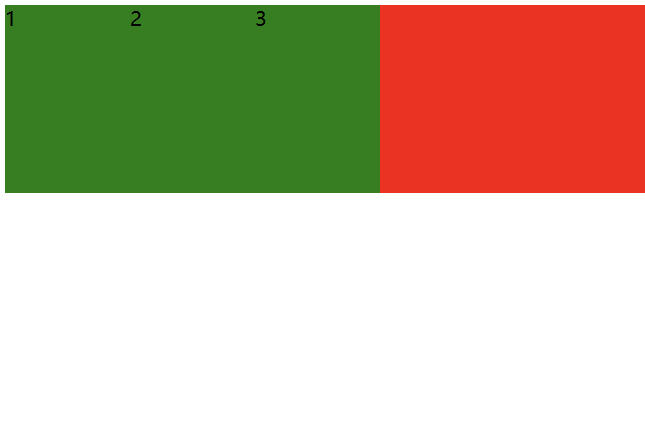
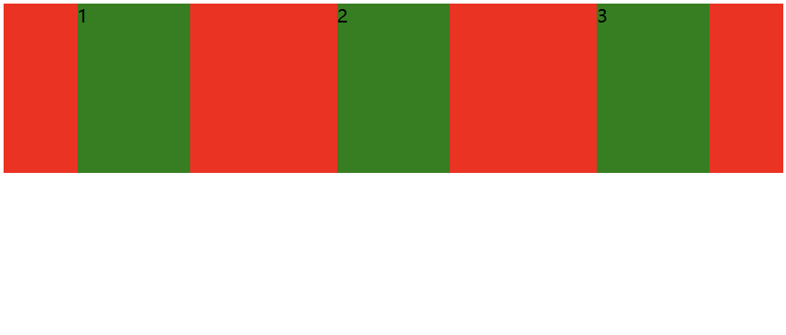
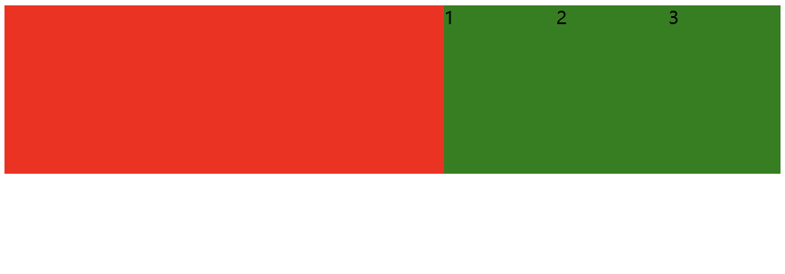
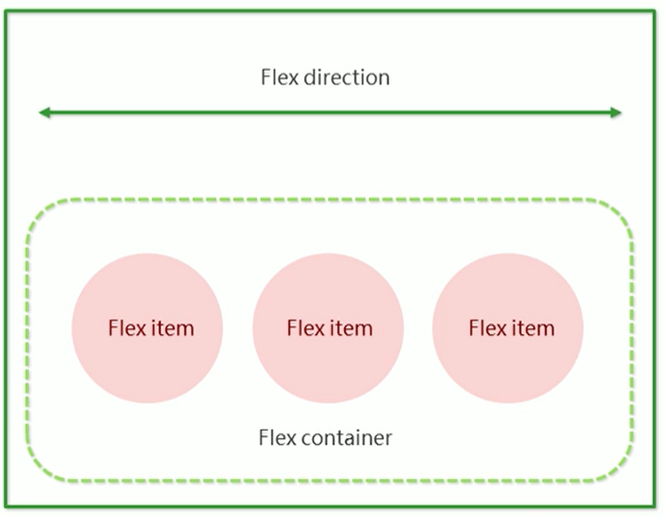
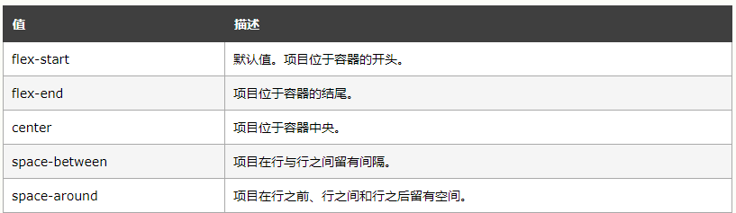
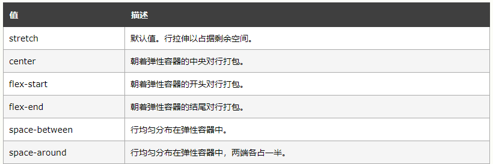

# 弹性布局

网页布局时 CSS 的一个重点应用，布局的传统解决方案，基于盒装模型，依赖 display 属性 + position 属性 + float 属性，对于那些特殊布局就不容易实现。2009年，W3C提出了一种新的方案——Flex布局，可以简便、完整、响应式地实现各种页面布局。

## 一、初体验

创建一个 div，内部包含三个 span

```html
<div>
    <span>1</span>
    <span>2</span>
    <span>3</span>
</div>
<style>
    div {
        width: 100%;
        height: 150px;
        background-color: red;
    }

    div>span {
        background-color: green;
        width: 100px;
    }
</style>
```



当我们给 div 加上 display: flex 之后，效果为：



此时看到，span 有了高度，不再是**行内元素**了。再给 div 加上 justify-content: space-around; 此时效果为：



此时看到这些 span 已经能够水平隔开了。

把 justify-content: space-around; 改为 justify-content: flex-end; 可以看到此时三个元素在右侧显示了



## 二、flex 布局基本概念

任何一个 html 元素，都可以指定为 display: flex 完成弹性布局。flex 的本质是给父盒子添加 display: flex 属性，来控制盒子的位置和排列方式。

### 1.基础概念

1. 被设置为 display:flex 属性的元素，称为 flex container
2. 它的所有子元素立刻称为了该容器的成员，称为 flex item
3. flex item 可以纵向排列，也可以横向排列，称为 flex direction（主轴）



**注意：**
当父元素设置为 display: flex 之后，子元素的 float、clear、vertical-align 都会失效

### 2.常用属性

#### 2.1 justify-content

设置主轴上的子元素排列方式

属性取值：



#### 2.2 align-items

设置侧轴上的元素排列方式

在上面的代码中, 我们是让元素按照主轴的方向排列, 同理我们也可以指定元素按照侧轴方向排列：



**注意：**

align-items 只能针对单行元素来实现，如果有多行元素，就需要使用 item-contents
