# JS Web API

## 一、背景知识

JS 主要分成三个大的部分：

- ECMAScript：基础语法部分
- DOM API：操作页面结构
- BOM API：操作浏览器

WebAPI 就包含了 DOM + BOM

[WebAPI参考文档](https://developer.mozilla.org/zh-CN/docs/Web/API)

## 二、DOM基本概念

### 1.什么是 DOM

DOM 全称为 Document Object Model，即文档对象模型，W3C 标准给我们提供了一系列的函数，让我们可以操作：

- 网页内容
- 网页结构
- 网页样式

### 2.DOM 树

一个页面的结构就是一个树形结构，称为 DOM 树：

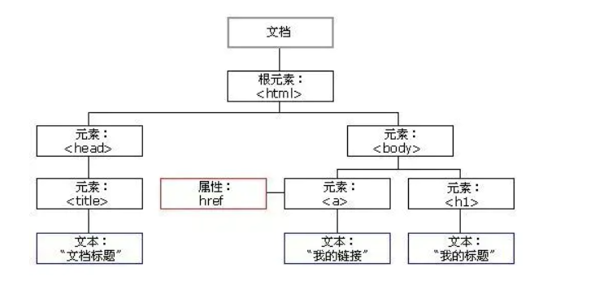

- 文档：一个页面就是一个文档，使用 document 表示
- 元素：页面中的所有标签都称为元素，使用 element 表示
- 节点：网页中所有的内容都可以称为节点（标签节点、注释节点、文本节点、属性节点等），使用 node 表示

这些文档等概念在 JS 代码中就对应一个个对象，所以才叫**文档对象模型**

## 三、获取元素

这部分工作类似于 CSS 选择器的功能

### 1.querySelector

> 这个是 HTML5 新增的，IE9 及以上版本才能使用

```js
var element = document.querySelector(selectors);
```

- selectors 包含一个或多个要匹配的选择器的 DOM字符串 DOMString 。 该字符串必须是有效的 CSS 选择器字符串；如果不是，则引发 SYNTAX_ERR 异常
- 表示文档中与指定的一组 CSS 选择器匹配的第一个元素的 html 元素 Element 对象. 
- 如果需要与指定选择器匹配的所有元素的列表，则应该使用 querySelectorAll()
- 可以在任何元素上调用，不仅仅是 document。 调用这个方法的元素将作为本次查找的根元素

> 正因为参数是选择器，所以一定要通过特殊符号指定是哪种选择器
> 例如：box 是类选择器，#star 是 id 选择器等

```html
<div class="box">abc</div>
<div id="id">def</div>
<h3><span><input type="text"></span></h3>
<script>
    var elem1 = document.querySelector('.box');
    console.log(elem1);
    var elem2 = document.querySelector('#id');
    console.log(elem2);
    var elem3 = document.querySelector('h3 span input');
    console.log(elem3);
</script>
```

结果如下：

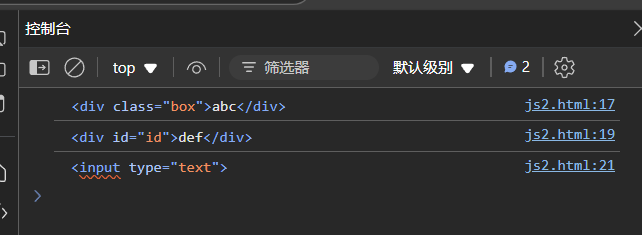

### 2.querySelectorAll

使用 querySelectorAll 用法和上面类似。

```html
<div class="box">abc</div>
<div id="id">def</div>
<script>
    var elems = document.querySelectorAll('div');
    console.log(elems);
</script>
```

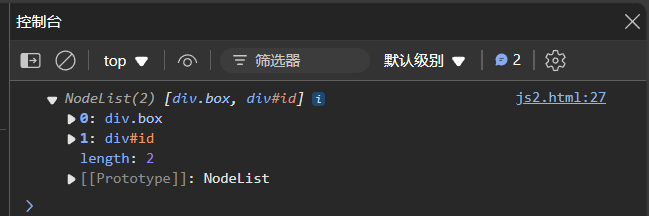

## 四、事件

### 1.基本概念

JS 要构建动态页面，就需要感知用户的行为。用户对于页面的一些操作（点击，选择，修改等）都会在浏览器中产生一个个事件被 JS 获取到，从而进行更复杂的交互操作。

### 2.事件的三要素

1. 事件源：那个元素触发的
2. 事件类型：是点击，选中，还是修改
3. 事件处理程序：进一步如何处理，往往是一个回调函数

### 3.点击事件

```html
<button id="btn">点我一下</button>
<script>
    var btn = document.getElementById('btn');
    btn.onclick = function () {
        alert("hello world");
    }
</script>
```

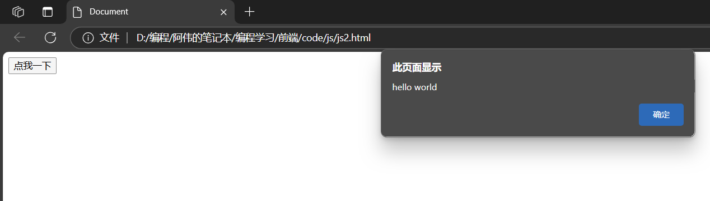

- btn 按钮就是事件源

- 点击就是事件类型

- function 这个匿名函数就是事件处理程序

  这个匿名函数相当于一个回调函数，这个函数不需要程序员主动调用，而是交给浏览器，由浏览器自动在合适的时机（触发点击操作时）进行调用

- 其中 `btn.onclick = function ()` 这个操作被称为注册事件/绑定事件

### 4.键盘事件

#### 4.1 键盘按下

##### 4.1.1 onkeydown

不区分大小写

```html
<input type="text">
<script>
    let ipt = document.querySelector('input');
    ipt.onkeydown = function() {
        console.log("键盘被按下!");
    }
</script>
```


```html
<input type="text">
<script>
    let ipt = document.querySelector('input');
    // event 是一个全局变量，保存当前事件的一些属性
    ipt.onkeydown = function(event) {
        // 获取按下了什么键
        let ch = event.keyCode;
        // 转化成字母
        ch = String.fromCharCode(ch);
        console.log("键盘被按下" + ch + "键");
    }
</script>
```

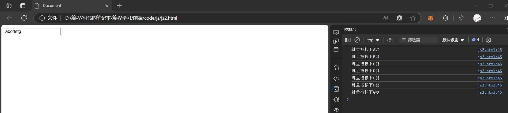

##### 4.1.2 onkeypress

区分大小写

```html
<input type="text">
<script>
    let ipt = document.querySelector('input');
    // event 是一个全局变量，保存当前事件的一些属性
    ipt.onkeypress = function(event) {
        // 获取按下了什么键
        let ch = event.keyCode;
        // 转化成字母
        ch = String.fromCharCode(ch);
        console.log("键盘被按下" + ch + "键");
    }
</script>
```

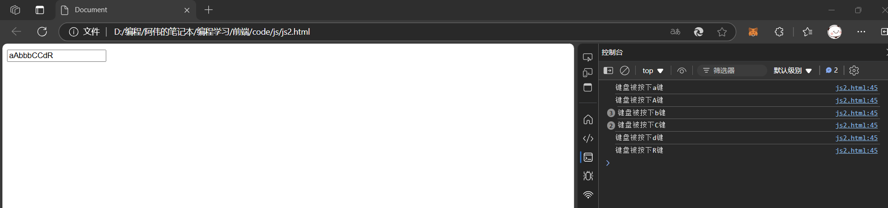

#### 4.2 键盘松开

```html
<input type="text">
<script>
    let ipt = document.querySelector('input');
    // event 是一个全局变量，保存当前事件的一些属性
    ipt.onkeypress = function(event) {
        // 获取按下了什么键
        let ch = event.keyCode;
        // 转化成字母
        ch = String.fromCharCode(ch);
        console.log("键盘被按下" + ch + "键");
    }
    ipt.onkeypress = function(event) {
        console.log("按键被松开")
    }
</script>
```

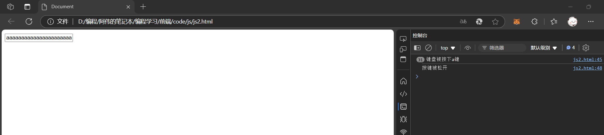

## 五、操作元素

### 1.获取/修改元素内容

#### 1.1 innerText

Element.innerText 属性表示一个节点及其后代的渲染文本内容

```html
<div>
    <span>hello world</span>
    <span>hello world</span>
</div>
<script>
    var div = document.querySelector('div');
    // 读取 div 内部内容
    console.log(div.innerText);
    // 修改 div 内部内容, 界面上就会同步修改
    div.innerText = 'hello js <span>hello js</span>';
</script>
```

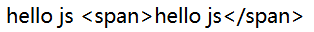

可以看到，通过 innerText 无法获取到 div 内部的 html 结构，只能得到文本内容，修改页面的时候也会把 span 标签当成文本进行设置。

#### 1.2 innerHTML

Element.innerHTML 属性设置或获取 HTML 语法表示的元素的后代

```html
<div>
    <span>hello world</span>
    <span>hello world</span>
</div>
<script>
    var div = document.querySelector('div');
    // 读取页面内容
    console.log(div.innerHTML);
    // 修改页面内容
    div.innerHTML = '<span>hello js</span>'
</script>
```

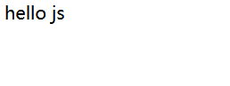

可以看到 innerHTML 不仅能获取到页面的 html 结构，同时也能修改结构，并且获取到的内容保留空格和换行

### 2.获取/修改元素属性

可以通过 Element 对象的属性来直接修改，就能影响到页面显示效果

```html

<script>
    var img = document.querySelector('img');
    // dir 查看对象中的属性
    console.dir(img);
</script>
```

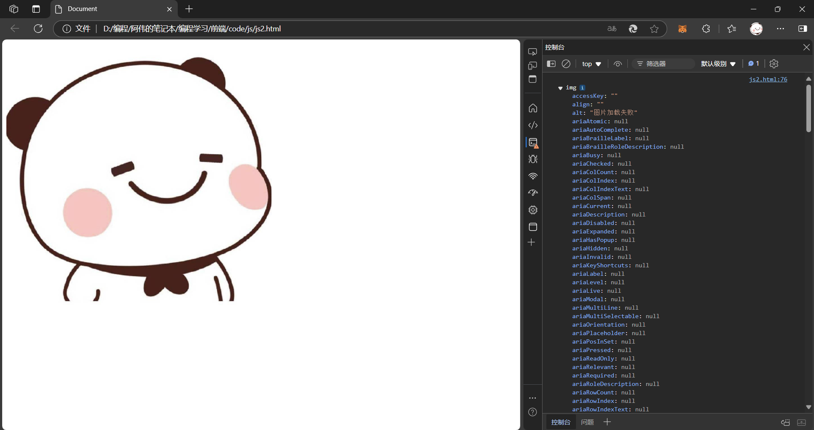

实现点击切换图片的效果：

```html

<script>
    var img = document.querySelector('img');
    function changepic() {
        // 检查 file:///D:/%E7%BC%96%E7%A8%8B/%E9%98%BF%E4%BC%9F%E7%9A%84%E7%AC%94%E8%AE%B0%E6%9C%AC/%E7%BC%96%E7%A8%8B%E5%AD%A6%E4%B9%A0/%E5%89%8D%E7%AB%AF/code/js/ahwei.jpg 的最后一项
        if (img.src.lastIndexOf('ahwei.jpg') !== -1) {
            img.src = 'ahwei_mirror.jpg';
        } else {
            img.src = 'ahwei.jpg';
        }
    }
```


### 3.获取/修改表单元素属性

表单（主要指 input 标签）的以下属性都可以通过 DOM 修改：

- value：input 的值
- disabled：禁用
- checked：复选框会使用
- selected：下拉框会使用
- type：input 的类型（文本、密码、按钮、文件等）

切断播放按钮，在播放和暂停之间切换：

```html
<input type="button" value="播放">
<script>
    var btn = document.querySelector('input');
    btn.onclick = function () {
        if (btn.value === '播放') {
            btn.value = '暂停';
        } else {
            btn.value = '播放';
        }
    }
</script>
```

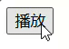

点击计数：

```html
<input type="text" id="text" value="0">
<input type="button" id="btn" value='点我+1'>
<script>
    var text = document.querySelector('#text');
    var btn = document.querySelector('#btn');
    btn.onclick = function () {
        var num = text.value;
        console.log(num);
        num++;
        text.value = num;
    }
</script>
```

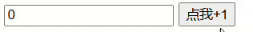

- input 具有一个重要的属性 value，这个 value 决定了表单元素的内容
- 如果是输入框，value 表示输入框的内容，修改这个值会影响到界面样式，在界面上修改这个值也会影响到代码中的属性
- 如果是按钮，value 表示按钮的内容，可以通过这个来实现按钮中文本的替换

全选/取消全选按钮：

```html
<input type="checkbox" id="all">我全都要 <br>
<input type="checkbox" class="girl">貂蝉 <br>
<input type="checkbox" class="girl">小乔 <br>
<input type="checkbox" class="girl">安琪拉 <br>
<input type="checkbox" class="girl">妲己 <br>
<script>
    // 1. 获取到元素
    var all = document.querySelector('#all');
    var girls = document.querySelectorAll('.girl');
    // 2. 给 all 注册点击事件, 选中/取消所有选项
    all.onclick = function () {
        for (var i = 0; i < girls.length; i++) {
            girls[i].checked = all.checked;
        }
    }
    // 3. 给 girl 注册点击事件
    for (var i = 0; i < girls.length; i++) {
        girls[i].onclick = function () {
            // 检测当前是不是所有的 girl 都被选中了. 
            all.checked = checkGirls(girls);
        }
    }
    // 4. 实现 checkGirls
    function checkGirls(girls) {
        for (var i = 0; i < girls.length; i++) {
            if (!girls[i].checked) {
                // 只要一个 girl 没被选中, 就认为结果是 false(找到了反例)
                return false;
            }
        }
        // 所有 girl 中都没找到反例, 结果就是全选中
        return true;
    }
</script>
```

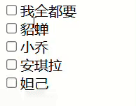

### 4.获取修改样式属性

CSS 中指定给元素的属性，都可以通过 JS 来修改

#### 4.1 行内样式操作

```js
element.style.属性名 = 属性值;
element.style.cssText = 属性名 + 属性值;
```

行内样式用过 style 直接在标签上修改指定的样式优先级很高，适用于修改样式少的情况。

点击文字放大字体：

> style 中的属性都是通过驼峰命名的方式和 CSS 属性对应的
>
> 例如：font-size => fontSize，background-color => backgroundColor 等
>
> 这种方式修改只影响到特定样式，其他内联样式的值不变

```html
<div style="font-size: 20px; font-weight: 700;">
    阿伟
</div>
<script>
    var div = document.querySelector('div');
    div.onclick = function () {
        var curFontSize = parseInt(this.style.fontSize);
        curFontSize += 10;
        this.style.fontSize = curFontSize + "px";
    }
</script>
```

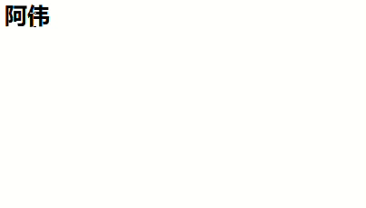

#### 4.2 类名样式操作

```js
element.className = CSS类名;
```

修改元素的 CSS 类名，适用于修改样式很多的情况

> 由于 class 是 JS 保留的关键字，所以名字叫做 className

开启夜间模式：

```html
<!DOCTYPE html>
<html lang="en">

<head>
    <meta charset="UTF-8">
    <meta http-equiv="X-UA-Compatible" content="IE=edge">
    <meta name="viewport" content="width=device-width, initial-scale=1.0">
    <title>Document</title>
    <style>
        * {
            margin: 0;
            padding: 0;
        }

        html,
        body {
            width: 100%;
            height: 100%;
        }

        .container {
            width: 100%;
            height: 100%;
        }

        .light {
            background-color: #f3f3f3;
            color: #333;
        }

        .dark {
            background-color: #333;
            color: #f3f3f3;
        }
    </style>
</head>

<body>
    <div class="container light">
        床前明月光 <br>
        疑是地上霜 <br>
        举头望明月 <br>
        低头思故乡 <br>
    </div>
    <script>
        var div = document.querySelector('div');
        div.onclick = function () {
            console.log(div.className);
            if (div.className.indexOf('light') != -1) {
                div.className = 'container dark';
            } else {
                div.className = 'container light';
            }
        }
    </script>
</body>
</html>
```

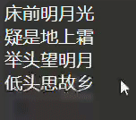

## 六、操作节点

### 1.新增节点

#### 1.1 创建元素节点

使用 createElement 方法来创建一个元素，options 参数暂时不关注

```js
var element =document.createElement(tagName[, options]);
```

示例：

```html
<div class="container"></div>
<script>
    var div = document.createElement('div');
    div.id = 'child'
    div.className = 'box';
    div.innerHTML = 'ahwei';
</script>
```

此时什么也没有，这是因为这时还没把节点插入到 DOM 树上

> 上面介绍的只是创建元素节点，还可以使用：
>
> - createTextNode 创建文本节点
> - createComment 创建注释节点
> - createAttribute 创建属性节点

#### 1.2 把元素节点插入到 DOM 树上

- 使用 appendChild 将节点插入到指定节点的最后一个孩子之后

  ```js
  element.appendChild(aChild)
  ```

  ```html
  <div class="container"></div>
  <script>
      var div = document.createElement('div');
      div.id = 'child'
      div.className = 'box';
      div.innerHTML = 'ahwei';
      var element = document.querySelector(".container");
      element.appendChild(div);
  </script>
  ```

  这时网页上显示出了 ahwei

- 使用 insertBefore 将节点插入到指定节点之前

  ```js
  var insertedNode = parentNode.insertBefore(newNode, referenceNode);
  ```

  > - insertedNode 被插入节点（newNode）
  > - parentNode 新插入节点的父节点
  > - newNode 用于插入的节点
  > - referenceNode newNode 将要插在这个节点之前
  >
  > 如果 referenceNode 为 null 则 newNode 将被插入到子节点的末尾
  >
  > 注意：referenceNode 引用节点不是可选参数
  
  ```html
  <div class="container">
      <div>11</div>
      <div>22</div>
      <div>33</div>
      <div>44</div>
  </div>
  <script>
      var newDiv = document.createElement('div');
      newDiv.innerHTML = '我是新的节点';
      var container = document.querySelector('.container');
      console.log(container.children);
      container.insertBefore(newDiv, container.children[0]);
  </script>
  ```
  
  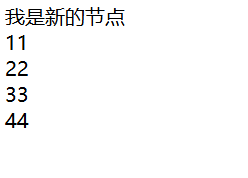
  
  **注意：**
  
  - 如果针对一个节点插入两次，则只有最后一次生效（相当于把元素移动了）
  - 一旦一个节点插入完毕，再针对刚刚的节点对象进行修改，能够同步影响到 DOM 树中的内容

### 2.删除节点

```js
oldChild = element.removeChild(child);
```

- child 为待删除节点
- element 为 child 的父节点
- 返回值为该被删除节点
- 被删除节点只是从 dom 树被删除了, 但是仍然在内存中, 可以随时加入到 dom 树的其他位置
- 如果上例中的 child节点 不是 element 节点的子节点，则该方法会抛出异常
