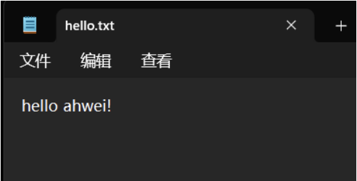
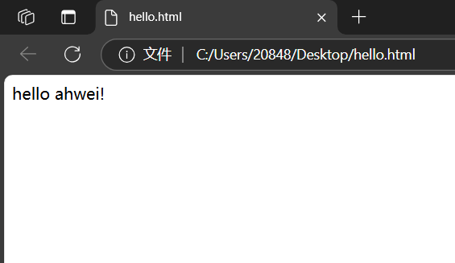
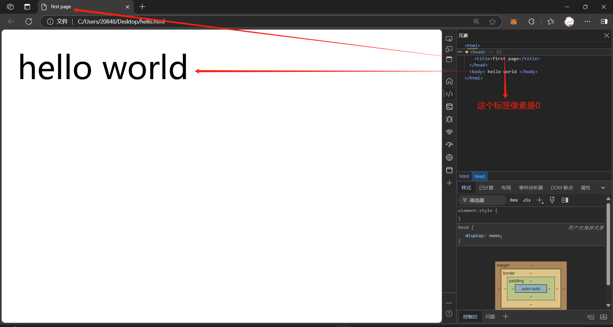
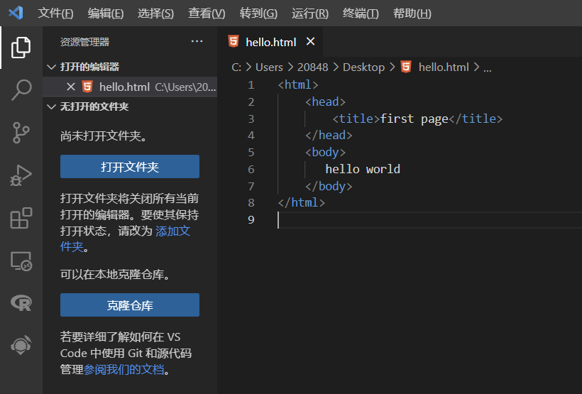
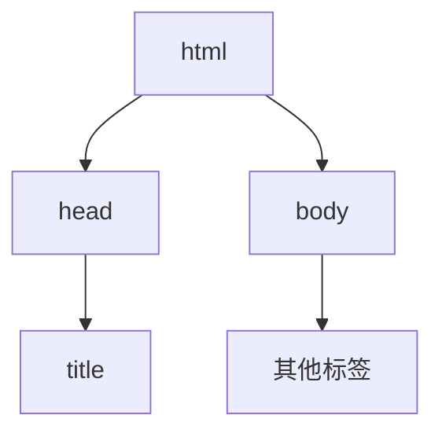

# HTML 基础

**HTML 超文本传输协议**

超文本：文本、声音、图片、链接、视频等

标记：由许许多多的标签组成

HTML 页面是运行在浏览器上面的

## 一、HTML结构

### 1.标签

形如

```html
<body>hello</body>
```

- 标签名 `body` 放到 < > 中

- 大部分标签成对出现， `<body>` 为开始标签，`</body>` 为结束标签 

- 少数标签只有开始标签，称为 "单标签"

- 开始标签和结束标签之间，写的是标签的内容 (hello)

- 开始标签中可能会带有 "属性"， `id` 属性相当于给这个标签设置了一个唯一的标识符（身份证号码）

  ```html
  <body id="myId">hello</body>
  ```

### 2.HTML 文件基本结构

HTML 文件示例：

记事本编写代码，用浏览器打开：（这样是不标准的）

<center class="half">    
	
    
</center>

标准写法：

<center class="half">    
	
    
</center>

- `html` 标签是整个 `html` 文件的根标签（最顶层标签）
- `head` 标签中写页面的属性
- `body` 标签中写页面上显示的内容
- `title` 标签中写页面的标题

### 3.标签层次结构

分为父子关系和兄弟关系

标签之间的结构关系，构成了一个 DOM （Document Object Mode (文档对象模型)）树



### 4.快速生成代码框架

`! + Enter`

```html
<!DOCTYPE html> <!-- 指定当前版本为 HTML5 -->
<html lang="en"> <!-- 指定当前页面内容是英文的 -->
    <head>
        <meta charset="UTF-8"> <!-- 浏览器解码规则 -->
        <meta http-equiv="X-UA-Compatible" content="IE=edge"> <!-- 渲染效果按照IE浏览器最高效果展示 -->
        <meta name="viewport" content="width=device-width, initial-scale=1.0"> <!-- 移动端适配 -->
        <title>Document</title>
    </head>
        
    </body>
</html>
```

