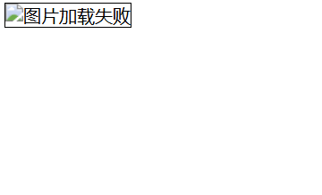
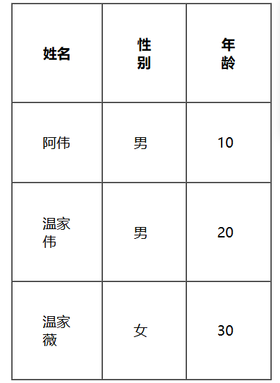
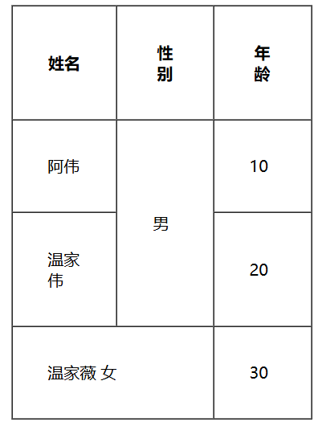
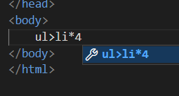
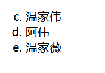
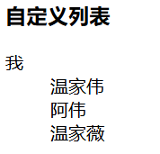
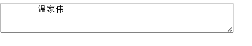
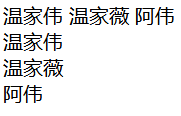

# HTML 标签

## 一、注释标签

```html
<!-- 我是注释 -->
```

因为用户在浏览器按 F12 可以看到注释，所以不要写负能量的注释。

## 二、标题标签

有六个, 从 h1 - h6。 数字越大, 则字体越小。

```html
<h1>hello</h1>
<h2>hello</h2>
<h3>hello</h3>
<h4>hello</h4>
<h5>hello</h5>
<h6>hello</h6>
```

## 三、段落标签

```html
<p>这是一个段落</p>
```

注意：

- p 标签之间存在一个空隙
- 当前的 p 标签描述的段落, 前面还没有缩进
- 自动根据浏览器宽度来决定排版
- html 内容首尾处的换行，空格均无效
- 在 html 中文字之间输入的多个空格只相当于一个空格
- html 中直接输入换行不会真的换行，而是相当于一个空格

## 四、换行标签

br 是 break 的缩写，表示换行

- br 是一个单标签（不需要结束标签）
- br 标签不像 p 标签那样带有一个很大的空隙
- `<br/>` 是规范写法. 不建议写成 `<br>`

## 五、格式化标签

- 加粗：strong 标签 和 b 标签
- 倾斜：em 标签 和 i 标签
- 删除线：del 标签 和 s 标签
- 下划线：ins 标签 和 u 标签

```html
<strong>strong 加粗</strong>
<b>b 加粗</b>

<em>倾斜</em>
<i>倾斜</i>

<del>删除线</del>
<s>删除线</s>

<ins>下划线</ins>
<u>下划线</u>
```

使用 CSS 也可以完成类似的效果，实际开发中以 CSS 方式为主

## 六、图片标签

img 标签必须带有 src 属性，表示图片的路径

```html

```

此时要把 ahwei.jpg 这个图片文件放到和 html 中的同级目录中

**img 标签的其他属性**：

- alt：替换文本，当文本不能正确显示的时候，会显示一个替换的文字 

  ```
  
  ```

  

- title：提示文本，鼠标放到图片上，就会有提示. 

- width/height：控制宽度高度，高度和宽度一般改一个就行, 另外一个会等比例缩放，否则就会图片
  失衡

- border：边框，参数是宽度的像素，但是一般使用 CSS 来设定

**注意：**

1. 属性可以有多个，不能写到标签之前
2. 属性之间用空格分割，可以是多个空格，也可以是换行

3. 属性之间不分先后顺序
4. 属性使用 "键值对" 的格式来表示

关于目录结构：
对于一个复杂的网站, 页面资源很多, 这种情况可以使用目录把这些文件整理好. 

1) 相对路径：以 html 所在位置为基准, 找到图片的位置. 
- 同级路径：直接写文件名即可 (或者 ./)
- 下一级路径：image/1.jpg
- 上一级路径：../image/1.jpg
2) 绝对路径：一个完整的磁盘路径, 或者网络路径. 例如
- 磁盘路径 D:\1.jpg
- 网络路径 https://cn.bing.com/images/search?view=detailV2&ccid=AOI88v8T&id=863E1A20E3EB7D04599019958377A49218C0A6F8&thid=OIP.AOI88v8TvFyVKmc7eRezDAHaEo&mediaurl=https%3A%2F%2Ftgi12.jia.com%2F114%2F936%2F14936926.jpg&exph=1200&expw=1920&q=%E8%8A%B1&simid=608020580956195481&FORM=IRPRST&ck=FAF7751EE82DCCFD566E05981671819F&selectedIndex=0&itb=0&qpvt=%E8%8A%B1&cw=898&ch=680&ajaxhist=0&ajaxserp=0

## 七、超链接标签

- href：必须具备，表示点击后会跳转到哪个页面
- target：打开方式. 默认是 _self，如果是 _blank 则用新的标签页打开

**链接的几种形式：**

1. 外部链接：href 引用其他网站的地址

   ```html
   <a href="http://www.baidu.com">百度</a>
   ```

2. 内部链接：网站内部页面之间的链接，写相对路径即可

   在一个目录中, 先创建一个 1.html, 再创建一个 2.html

   ```html
   <!-- 1.html -->
   我是 1.html
   <a href="2.html">点我跳转到 2.html</a>
   <!-- 2.html -->
   我是 2.html
   <a href="1.html">点我跳转到 1.html</a>
   ```

3. 空链接：使用 # 在 href 中占位，打开了当前页面，相当于做了次刷新

   ```html
   <a href="#">空链接</a>
   ```

4. 下载链接：href 对应的路径是一个文件（可以使用 zip 文件）

   ```html
   <a href="test.zip">下载文件</a>
   ```

5. 网页元素链接：可以给图片等任何元素添加链接（把元素放到 a 标签中）

   ```html
   <a href="http://www.sogou.com">
       
   </a>
   ```

6. 锚点链接：可以快速定位到页面中的某个位置

   ```html
   <a href="#one">第一集</a>
   <a href="#two">第二集</a>
   <a href="#three">第三集</a>
   <p id="one">
      第一集剧情 <br>
      第一集剧情 <br>
      ...
   </p>
   <p id="two">
      第二集剧情 <br>
      第二集剧情 <br>
    ...
   </p>
   <p id="three">
      第三集剧情 <br>
      第三集剧情 <br>
    ...
   </p>
   ```

7. 禁止 a 标签跳转

   ```html
   <a href="javascript:void(0);"> 
   <!-- 或者 --> 
   <a href="javascript:;">
   ```


## 八、表格标签

> [!NOTE]
>
> 选中代码，shift + alt + $\downarrow$ 可以快速复制代码

- table 标签：表示整个表格
- tr：表示表格的一行
- td：表示一个单元格
- th：表示表头单元格. 会居中加粗
- thead：表格的头部区域（注意和 th 区分, 范围是比 th 要大的）
- tbody：表格得到主体区域

table 包含 tr，tr 包含 td 或者 th

表格标签有一些属性，可以用于设置大小边框等，但是一般使用 CSS 方式来设置，这些属性都要放到 table 标签中

- align：是表格相对于周围元素的对齐方式。align="center" （不是内部元素的对齐方式）
- border：表示边框。1 表示有边框（数字越大，边框越粗）， "" 表示没边框. 
- cellpadding：内容距离边框的距离，默认 1 像素
- cellspacing：单元格之间的距离，默认为 2 像素
- width / height：设置尺寸

```html
<table align="center" border="1" cellpadding="35" cellspacing="0" width="300" height="20">
    <thead>
        <tr>
            <th>姓名</th>
            <th>性别</th>
            <th>年龄</th>
        </tr>
    </thead>
    <tbody>
        <tr>
            <td>阿伟</td>
            <td>男</td>
            <td>10</td>
        </tr>
        <tr>
            <td>温家伟</td>
            <td>男</td>
            <td>20</td>
        </tr>
        <tr>
            <td>温家薇</td>
            <td>女</td>
            <td>30</td>
        </tr>
    </tbody>
</table>
```



> [!NOTE]
>
> - 表头自动加粗并居中
> - 表体则没有

**表格合并：**

- 跨行合并：rowspan="n"
- 跨列合并：colspan="n"

```html
<table align="center" border="1" cellpadding="35" cellspacing="0" width="300" height="20">
    <thead>
        <tr>
            <th>姓名</th>
            <th>性别</th>
            <th>年龄</th>
        </tr>
    </thead>
    <tbody>
        <tr>
            <td>阿伟</td>
            <td rowspan="2">男</td>
            <td>10</td>
        </tr>
        <tr>
            <td>温家伟</td>
            <td>20</td>
        </tr>
        <tr>
            <td colspan="2">温家薇 女</td>
            <td>30</td>
        </tr>
    </tbody>
</table>
```



## 九、列表标签

- 元素之间是并列关系
- ul/ol 中只能放 li 不能放其他标签，dl 中只能放 dt 和 dd
- li 中可以放其他标签
- 列表带有自己的样式，可以使用 CSS 来修改。（例如前面的小圆点都会去掉）

### 1.无序列表

列表生成快捷方式



```html
<ul type="circle">
    <li>1</li>
    <li>2</li>
    <li>3</li>
    <li>4</li>
</ul>
```

- type属性：
  - circle：空心圆
  - square：实心方块
  - disc：实心圆（默认）

### 2.有序列表

```html
<ol type="a" start="3">
    <li>温家伟</li>
    <li>阿伟</li>
    <li>温家薇</li>
</ol>
```

- type属性：

  - a：小写字母
  - A：大写字母
  - i：小写罗马数字
  - I：大写罗马数字
  - 1：数字编号（默认）

- start属性：

  从几开始



### 3.自定义列表

- dl：总标签
- dt：小标题
- dd：内容

```html
<dl>
    <dt>我</dt>
    <dd>温家伟</dd>
    <dd>阿伟</dd>
    <dd>温家薇</dd>
</dl>
```



## 十、表单标签

用表单标签可以完成与服务器的交互

分成两个部分:

- 表单域：包含表单元素的区域，重点是 form 标签
- 表单控件：输入框，提交按钮等，重点是 input 标签

### 1.form标签

```html
<form action="test.html">
   ... [form 的内容]
</form>
```

描述了要把数据按照什么方式，提交到哪个页面中。

### 2.input 标签

各种输入控件，单行文本框，按钮，单选框，复选框。

- type(必须有)：button，checkbox，text，file，image，password，radio 等
- name：给 input 起了个名字，尤其是对于单选按钮，具有相同的 name 才能多选一
- value：input 中的默认值
- checked：默认被选中（用于单选按钮和多选按钮）
- maxlength：设定最大长度

#### 2.1 文本框

```html
<input type="text">
```

#### 2.2 密码框

```html
<input type="password">
```

#### 2.3 单选框

```html
性别: 
<input type="radio" name="sex">男
<input type="radio" name="sex" checked="checked">女
```

注意：单选框之间必须具备相同的 name 属性，才能实现**多选一**效果

#### 2.4 复选框

```html
爱好:
<input type="checkbox"> 吃饭 <input type="checkbox"> 睡觉 <input type="checkbox">
打游戏
```

#### 2.5 普通按钮

```html
<input type="button" value="我是个按钮">
```

需要搭配 JS 使用：

```html
<input type="button" value="我是个按钮" onclick="alert('hello')">
```

#### 2.6  提交按钮

```html
<form action="test.html">
    <input type="text" name="username">
    <input type="submit" value="提交">
</form>
```

提交按钮必须放到 form 标签内，点击后就会尝试给服务器发送

#### 2.7 清空按钮

```html
<form action="hello.html">
    <input type="text" name="username">
    <input type="submit" value="提交">
    <input type="reset" value="清空">
</form>
```

清空按钮必须放在 form 中，点击后会将 form 内所有的用户输入内容重置

#### 2.8 选择文件

```html
<input type="file">
```

### 3.label 标签

搭配 input 使用。点击 label 也能选中对应的单选/复选框，能够提升用户体验

for 属性：指定当前 label 和哪个相同 id 的 input 标签对应（此时点击才是有用的）

```html
<label for="male">男</label> <input id="male" type="radio" name="sex">
```

### 4.select 标签

option 中定义 selected="selected" 表示默认选中

```html
<select>
    <option>北京</option>
    <option selected="selected">上海</option>
</select>
```

可以给的第一个选项，作为默认选项

```html
<select>
    <option>--请选择年份--</option>
    <option>1991</option>
    <option>1992</option>
    <option>1993</option>
    <option>1994</option>
    <option>1995</option>
</select>
```

### 5.textarea 标签

文本域中的内容就是默认内容，注意空格也会有影响。输入超过 rows 后会出现滑轮，rows 和 cols 也都不会直接使用，都是用 css 来改的。

```html
<textarea rows="3" cols="50">
    温家伟
</textarea>
```



## 十一、无语义标签

div 标签，division 的缩写，含义是分割；span 标签，含义是跨度。其实就是两个盒子，用于网页布局：div 是独占一行的：是一个大盒子；span 不独占一行，是一个小盒子。

```html
<div>
    <span>温家伟</span>
    <span>温家薇</span>
    <span>阿伟</span>
</div>
<div>
    <div>温家伟</div>
    <div>温家薇</div>
    <div>阿伟</div>
</div>
```


