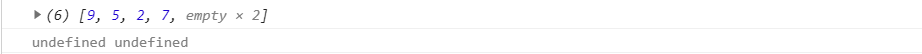
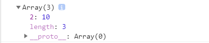
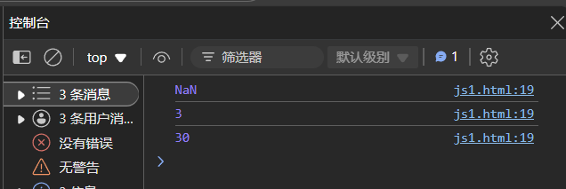
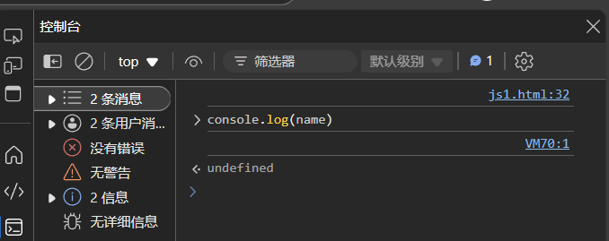
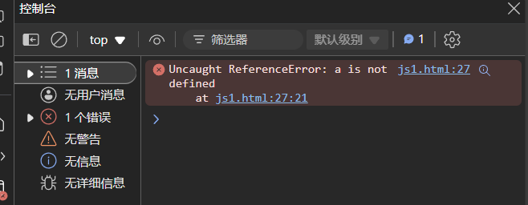
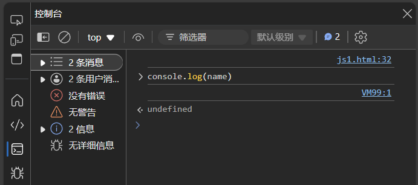
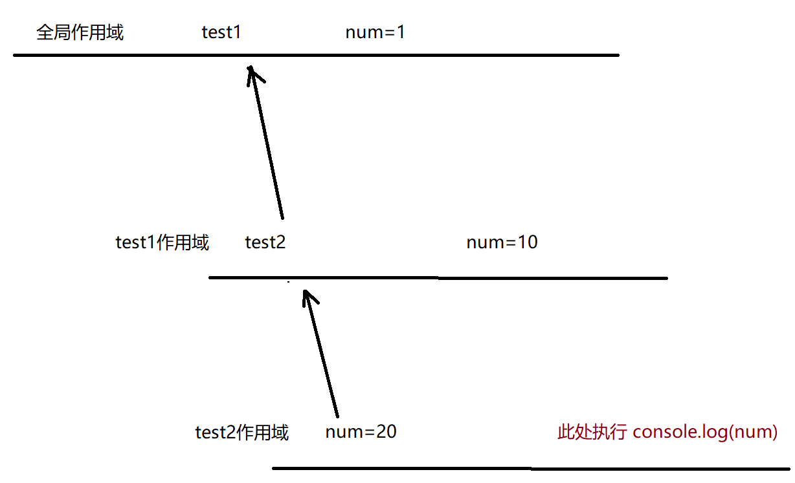
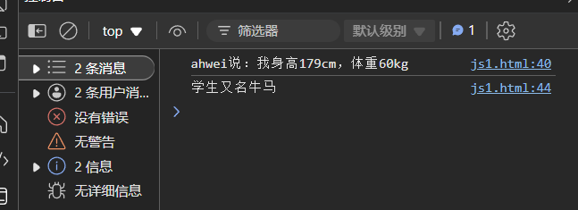
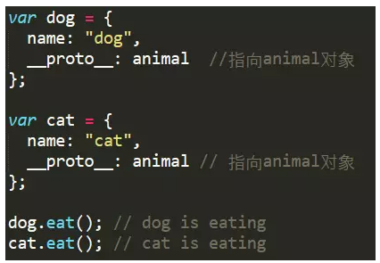
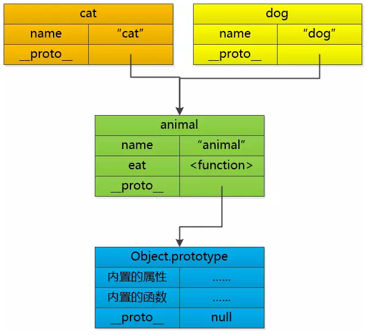

# JS 语法概览

## 一、变量的使用

### 1.基本语法

创建变量：

```js
var name = 'zhangsan';
let age = 20;
// 推荐使用 let 关键字
// ';' 可以省略，但还是建议加上
// 字符串用单引号或双引号包裹
```

使用变量：

```js
console.log(age); // 读取变量内容
age = 30; // 修改变量内容
```

代码示例：弹窗提示用户输入信息，再弹框显示。

```js
let name = prompt("请输入姓名:");
let age = prompt("请输入年龄:");
let score = prompt("请输入分数");
alert("您的姓名是: " + name);
alert("您的年龄是: " + age);
alert("您的分数是: " + score);
```

也可以合到一个弹窗里。

```js
let name = prompt("请输入姓名:");
let age = prompt("请输入年龄:");
let score = prompt("请输入分数");
alert("您的姓名是: " + name + "\n" + "您的年龄是: " + age + "\n" + "您的分数是: " + score + "\n");
// + 表示字符串拼接
```

### 2.动态类型

1. JS 的变量类型时程序运行的过程中才确定的（运行到 = 语句才会确定类型）

2. 随着程序运行，变量的类型可能发生改变

   ```js
   let a = 60;
   a = "passed"
   ```

3. JS 的变量是弱类型变量，在不同类型之间赋值的时候无需强制类型转化，可以**直接赋值**

## 二、基本的数据类型

JS 中内置的集中类型

- number：数字，不区分整数和小数
- boolean：true 真，false 假
- string：字符串类型
- undefined：只有唯一的值 undefined，表示未定义的值
- null：只有唯一的值 null，表示空值

### 1.number 数字类型

JS 中不区分整数和浮点数，统一都使用“数字类型”来表示。

#### 1.1 数字的进制表示

```js
let a = 07;   // 八进制整数，以 0 开头
let b = 0xa;  // 十六进制整数，以 0x 开头
let c = 0b10; // 二进制整数，以 0b 开头
```

- 一个八进制数字对应三个二进制数字
- 一个十六进制数字对应四个二进制数字

#### 1.2 特殊的数字值

```js
let max = Number.MAX_VALUE;
// 得到 Infinity，表示无穷大
console.log(max * 2);
// 得到 -Infinity，表示负无穷大
console.log(-max * 2);
// 得到 NaN，表示非数字
console.log('ahwei' - 10);
```

- 负无穷大和无穷小不是一回事，无穷小指的是无限趋近于 0，值为 $\dfrac{1}{Infinity}$

- `'ahwei' + 10` 得到的不是 NaN，而是 `ahwei10`，会把数字隐式转换成字符串并做拼接

- 可以使用 isNaN 函数判断是不是一个非数字

  ```js
  console.log(isNaN(10));  // false
  console.log(isNaN('hehe' - 10));  // true
  ```

### 2.string 字符串类型

#### 2.1 基本规则

字符串字面值需要使用引号包裹，单引号或双引号均可

```js
let a = "haha";
let b = 'hehe';
let c = hehe;    // 运行出错
```

如果字符串中已经包含引号，需要但双引号搭配或使用转义字符：

```js
let msg = "My name is "zhangsan"";    // 出错
let msg = "My name is \"zhangsan\"";  // 正确, 使用转义字符. \" 来表示字符串内部的引
号. 
let msg = "My name is 'zhangsan'";    // 正确, 搭配使用单双引号
let msg = 'My name is "zhangsan"';    // 正确, 搭配使用单双引号
```

#### 2.2 转义字符

有些字符不方便直接输入，于是要用过一些特殊方式来表示：

```js
\n
\\
\'
\"
\t
```

#### 2.3 求长度

使用 string 的 length 属性：

```js
let a = 'ahwei';
console.log(a.length); // 5
let b = '阿伟';
console.log(b.length); // 2
```

单位为字符的数量

#### 2.4 字符串拼接

使用 + 进行拼接：

```js
let a = "大家好";
let b = "我叫阿伟";
console.log(a + b);
```

数字和字符串也可以拼接：

```js
let c = "我的分数是：";
let score = 100;
lonsole.log(c + score);
```

**注意：**要认准相加的变量到底是字符串还是数字

```js
console.log(100 + 100);   // 200
sonsole.log('100' + 100); // 100100
```

### 3.boolean 类型

表示真和假，参与运算时当作 1 和 0 来看待。

```js
console.log(true + 1);
console.log(false + 1);
// 这样的操作其实是不科学的. 实际开发中不应该这么写
```

### 4.undefined 未定义数据类型

如果一个变量没有被初始化过，结果就是 undefined，是 undefined 类型。

- undefined 和字符串进行相加，结果进行字符串拼接：

  ```js
  console.log(a + "10"); // undefined10
  ```

- undefined 和数字进行相加，结果为 NaN

  ```js
  console.log(a + 10);
  ```

### 5.null 空值类型

null 表示当前的变量是一个空值。

```js
var b = null;
console.log(b + 10);   // 10
console.log(b + "10"); //null10
```

## 三、运算符

### 1.算数运算符

- +
- -
- *
- /
- %

### 2.赋值运算符 & 复合赋值运算符

- =
- +=
- -=
- *=
- /=
- %=

### 3.自增自减运算符

- ++
- --
### 4.比较运算符

- <
- \>
- <=
- \>=
- ==：比较相等，会进行隐式类型转换
- !=
- ===：比较相等，不会进行隐式类型转换
- !==

```js
let a = 10;
let b = '10';
console.log(a == b);  // true
console.log(a === b); // false
```

### 5.逻辑运算符

用于计算多个 boolean 表达式的值

- &&
- ||
- !

### 6.位运算

- &
- |
- ~
- ^

### 7.移位运算

- <<
- \>\>：有符号右移（算数右移）
- \>\>\>：无符号右移（逻辑右移）

## 四、条件语句

### 1.if 语句

```js
// 形式1
if (条件) {
    语句
}
// 形式2
if (条件) {
    语句1
} else {
    语句2
}
// 形式3
if (条件1) {
    语句1
} else if (条件2) {
    语句2   
} else if .... {
    语句...
} else {
    语句N
}
```

### 2.三元表达式

是 if else 的简化写法

```js
条件 ? 表达式1 : 表达式2;
```

条件为真，返回表达式1的值，条件为假返回表达式2的值。注意：三元表达式的优先级是比较低的。

### 3.switch

更适合多分支的场景

```js
switch (表达式) {
    case 值1:
        语句1;
        break;
    case 值2:
        语句2:
        break;
    default:
        语句N;
}
```

用户输入一个整数，提示今天是星期几：

```js
var day = prompt("请输入今天星期几: ");
// 注意这里要把 day 转化为数值类型
switch (parseInt(day)) {
    case 1:
        console.log("星期一");
        break;
    case 2:
        console.log("星期二");
        break;
    case 3:
        console.log("星期三");
        break;
    case 4:
        console.log("星期四");
        break;
    case 5:
        console.log("星期五");
        break;
    case 6:
        console.log("星期六");
        break;
    case 7:
        console.log("星期日");
        break;
    default:
        console.log("输入有误");
}
```

## 五、循环语句

### 1.while 循环

```js
while (条件) {
    循环体;
}
```

执行过程：

- 先执行条件语句
- 条件为真，执行循环体代码
- 条件为假，直接结束循环

### 2.continue

结束本次循环，跳转到条件判断部分

### 3.break

结束整个循环

### 4.for循环

```jsp
for (表达式1; 表达式2; 表达式3) {
 循环体
}
```

- 表达式1：用于初始化循环变量
- 表达式2：循环条件
- 表达式3：更新循环变量

执行过程：

1. 先执行表达式1，初始化循环变量
2. 再执行表达式2，判定循环条件
3. 条件为假，结束循环
4. 条件为真，执行循环体代码
5. 执行表达式3，更新循环变量

## 六、数组

### 1.创建数组

1. 使用 new 关键字创建

   ```js
   // Array 的 A 要大写
   let arr = new Array();
   ```

2. 使用字面量方式创建

   ```js
   let arr = [];
   let arr2 = [1, 2, 'haha', false]; // 数组中保存的内容称为 "元素"
   ```

**注意：**JS 数组不要求元素是相同类型

### 2.获取数组元素

使用下标方式访问数组元素，超出范围读取元素结果为 undefined

```js
let arr = ['小猪佩奇', '小猪乔治', '小羊苏西'];
console.log(arr[3]);   // undefined
console.log(arr[-1]);  // undefined
```

不要给数组名直接赋值，此时数组中的所有元素都没了：

```js
let arr = ['小猪佩奇', '小猪乔治', '小羊苏西'];
arr = '小猫凯迪';
// 相当于本来 arr 是一个数组，重新赋值后变成字符串了
```

### 3.新增数组元素

#### 3.1 通过修改 length 新增

相当于再末尾新增元素，新增的元素默认值为 undefined：

```js
let arr = [9, 5, 2, 7];
arr.length = 6;
console.log(arr);
console.log(arr[4], arr[5]);
```



#### 3.2 通过修改下标新增

如果下标超出范围赋值元素，则会给指定位置插入新元素

```js
let arr = [];
arr[2] = 10;
console.log(arr);
```



此时这个数组的 [0] 和 [1] 都是 undefined

#### 3.3 使用 push 进行追加元素

```js
let arr = [9, 5, 2, 7, 3, 6, 8];
let newArr = [];
for (let i = 0; i < arr.length; i++) {
    if (arr[i] % 2 != 0) {
        newArr.push(arr[i]);
   }
}
console.log(newArr);
```

### 4.删除数组中的元素

使用 splice 方法删除元素

```js
let arr = [9, 5, 2, 7];
// 第一个参数表示从下表为 2 的位置开始删除. 第二个参数表示要删除的元素个数是 1 个
arr.splice(2, 1);
console.log(arr);
// 结果
[9, 5, 7]
```

> 目前已经用到了数组中的一些属性和方法
>
> - arr.length，length 使用的时候不带括号，此时 length 就是一个普通的变量（称为成员变量，也叫属性）
> - arr.push()，arr.splice() 使用的时候带括号，并且可以传参数，此时是一个函数（也叫做方法）

## 七、函数

### 1.语法格式

```js
// 创建函数/函数声明/函数定义
function 函数名(形参列表) {
    函数体
    return 返回值;
}

// 函数调用
函数名(实参列表)           // 不考虑返回值
返回值 = 函数名(实参列表)   // 考虑返回值
```

函数的定义和调用的先后顺序没有要求（这一点和变量不同，变量必须先定义再使用）

```js
// 调用函数
hello();
// 定义函数
function hello() {
    console.log("hello");
}
```

### 2.关于参数个数

实参和形参之间的个数可以不匹配，但是**实际开发中一般要求匹配**。

#### 2.1 实参个数比形参个数多

多出的参数不参与函数运算。

#### 2.2 实参个数比形参个数少

少的那个参数值为 undefined

```js
function sum(a, b) {
    console.log(a + b);
}
sum(10);
sum(1, 2);
sum(10, 20, 30);
```



### 3.函数表达式

另一种函数定义的方式：

```js
var add = function() {
    var sum = 0;
    for (var i = 0; i < arguments.length; i++) {
        sum += arguments[i];
    }
    return sum;
}
console.log(add(10, 20));            // 30
console.log(add(1, 2, 3, 4));        // 10
console.log(typeof add);             // function
```

此时形如 function() { } 这样的写法定义了一个匿名函数，然后将这个匿名函数用一个变量来表示，后面就可以通过这个 add 变量来调用函数了。

### 4.作用域

- 全局作用域：在整个 script 标签中，或者单独的 js 文件中生效
- 局部作用域/函数作用域：在函数内部生效

**创建变量时如果不写 var 或 let，那么它是一个全局变量**

```js
function test() {
    num = 100;
}
test();
console.log(num);
// 执行结果
// 100
```

很多语言的作用域是通过代码块（大括号）区分的，JS 不是，它通过函数区分：

```js
if (1) {
    var a = 10;
}
console.log(a);
// 10
```

```js
function b() {
    name = "ahwei";
}
b();
console.log(name);
// ahwei
```

```js
function b() {
    var name = "ahwei";
}
b();
console.log(name);
```



使用 let 关键字则和普通语言一样了：

```js
if (1) {
    let a = 10;
}
console.log(a);
```



```js
function b() {
    let name = "ahwei";
}
b();
console.log(name);
```



### 5.作用域链

函数可以定义在函数内部，内层函数可以访问外层函数的局部变量，而且采用的是链式查找的方式，从内到外依次查找。

```js
var num = 1;
function test1() {
    var num = 10;
    function test2() {
        var num = 20;
        console.log(num);
    }
    test2();
}
test1();
// 执行结果
20
```



## 八、对象

### 1.使用字面量创建对象

使用 {} 创建

```js
var a = {};  // 创建了一个空的对象
var student = {
    name: '蔡徐坤',
    height: 175,
    weight: 170,
    sayHello: function() {
        console.log("hello");
    }
};
```

1. 使用 { } 创建对象
2. 属性和方法使用键值对的形式来组织
3. 键值对之间使用 `,` 分割，最后一个属性后面的 `,` 可有可无
4. 键和值之间使用 `:` 分割
5. 方法的值是一个匿名函数

使用对象的属性或方法：

```js
// 1. 使用 . 成员访问运算符来访问属性 `.` 可以理解成 "的"
console.log(student.name);
// 2. 使用 [ ] 访问属性, 此时属性需要加上引号
console.log(student['height']);
// 3. 调用方法, 别忘记加上 () 
student.sayHello();
```

### 2.使用 new Object 创建对象

```js
var student = new Object(); // 和创建数组类似
student.name = "蔡徐坤";
student.height = 175;
student['weight'] = 170;
student.sayHello = function () {
    console.log("hello");
}

console.log(student.name);
console.log(student['weight']);
student.sayHello();
```

**注意：**使用 {} 创建的对象也可以随时使用 `student.name = "蔡徐坤";` 这样的方式来新增属性

### 3.使用构造函数创建对象

前面的创建对象方式只能创建一个对象，而使用构造函数就可以很方便的创建多个对象：

```js
function 构造函数名(形参) {
    this.属性 = 值;
    this.方法 = function...
}

var obj = new 构造函数名(实参);
```

**注意：**

1. 在构造函数内部使用 this 关键字来表示当前正在构建的对象
2. 构造函数的函数名首字母一般是大写的
3. 构造函数不需要 return
4. 创建对象的时候必须使用 new 关键字

### 4.使用 class 关键字

和 Java 比较类似：

```js
class Student {
    constructor(name, height, weight) {
        this.name = name;
        this.height = height;
        this.weight = weight;
    }
    Say() {
        console.log(this.name + "说：我身高" + this.height + "cm，体重" + this.weight + "kg");
    }
    static othername = "牛马";
    static printOtherName() {
        console.log("学生又名" + Student.othername);
    }
}
ahwei = new Student("ahwei", 179, 60);
ahwei.Say();
Student.printOtherName();
```



### 5.new 关键字

new 的执行过程：

1. 先在内存中创建一个空的对象 {}
2. this 指向刚才的空对象（将上一步的对象作为 this 的上下文）
3. 执行构造函数的代码，给对象创建属性和方法
4. 返回这个对象（构造函数本身不需要 return，由 new 代劳了）

### 6.JavaScript 的对象和 Java 的对象的区别

1. Javascript 没有类的概念

   但是在 ES6 中也引入了 class 关键字，就能按照类似于 Java 的方式创建类和对象了

2. Javascript 对象不区分 **属性** 和 **方法**

3. JavaScript 对象没有 private / public 等访问控制机制

4. JavaScript 对象没有 **继承**

   Javascript 使用 **原型** 机制实现类似的效果

   例如：创建一个 cat 对象和 dog 对象，让这两个对象都能使用 animal 对象中的 eat 方法。通过 __proto__ 属性来建立这种关联关系 （proto 翻译作 "原型"）

   

   当 eat 方法被调用的时候，先在自己的方法列表中寻找， 如果找不到，就去找原型中的方法， 如果原型中找不到， 就去原型的原型中去寻找...... 最后找到Object那里， 如果还找不到， 那就是未定义了。

   

   **ES6 之后的继承：**

   类似 Java，使用 extends 关键字：

   ```js
   class ZJUTStudent extends Student {
       constructor(name, height, weight, skill) {
           super(name, height, weight);
           this.skill = skill;
       }
       // 重写 Say()
       Say() {
           console.log(this.name + "会" + this.skill);
       }
   }
   
   wjw = new ZJUTStudent("wjw", 179, 60, "工地搬砖");
   wjw.Say();
   // wjw会工地搬砖
   ```

5. JavaScript 没有多态

   JavaScript 中本身就支持动态类型，因此不需要语法层面上支持多态。