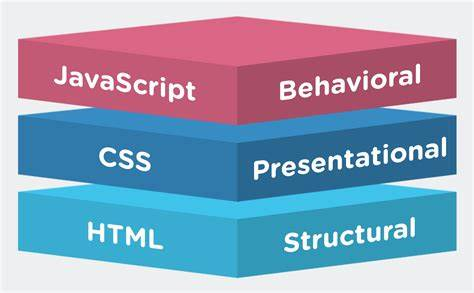

# 初识 JS

## 一、JavaScript 是什么

- 是世界上最流行的变成语言之一
- 是一个脚本语言，通过解释器运行
- 主要在客户端（浏览器）上运行，现在也可以基于 node.js 在服务器端运行

[Javascript诞生记](http://www.ruanyifeng.com/blog/2011/06/birth_of_javascript.html)

## 二、Javascript 和 HTML 和 CSS 之间的关系



- HTML：网页的结构（骨）
- CSS：网页的表现（皮）
- JavaScript：网页的行为（魂）

## 三、Javascript 运行过程

- 编写的代码时保存在文件中的，也就是存储在硬盘（外存）
- 双击 .html 文件浏览器（应用程序）就会读取文件，把文件内容加载到内存中（数据流向：硬盘 $\Rightarrow$ 内存）
- 浏览器会解析用户编写的代码，把代码翻译成二进制的，能让计算机识别的指令（解释器的工作）
- 得到的二进制指令会被 CPU 加载并执行（数据流向：内存 $\Rightarrow$ CPU）

## 四、Javascript 的组成

- ECMAScript（简称 ES）：Javascript 语法
- DOM：页面文档对象模型，对页面中的元素进行操作
- BOM：浏览器对象模型，对浏览器窗口进行操作

只有 JS 语法，只能写出一些基础的逻辑流程；想要完成更复杂的任务，完成和浏览器以及页面的交互，那么就需要 DOM API 和 BOM API（这里主要指的是在浏览器端运行的 JS，如果时运行在服务端的 JS，则需要使用 node.js 的API，就不太需要关注 DOM 和 BOM）

## 五、前置知识

JavaScript 代码可以嵌入到 HTML 的 script 标签中：

```html
<script>
	alert("你好!");
</script>
```

## 六、JavaScript 的书写形式

### 1.行内式

直接嵌入到 html 元素内部

```html
<input type="button" value="点我" onclick="alert('hello world!')">
```

**注意：**

JS 中字符串常量可以使用单引号，也可以使用双引号表示，**HTML中推荐使用双引号，JS 中推荐使用单引号**

### 2.内嵌式

写到 script 标签：

```html
<script>
    alert("hello world!");
</script>
```

### 3.外部式

写到单独的 .js 文件中

```html
<script src="hello.js"></script>
```

```javascript
alert("hello world");
```

> 注意：这种情况下 script 标签中间不能写代码，必须空着，写了也不会执行。

### 4.注释

- 单行注释：//
- 多行注释：/* */
- 注释不能嵌套

### 5.输入输出

#### 5.1 输入

弹出一个输入框：

```javascript
// 弹出一个输入框
prompt("请输入您的姓名：")
```

#### 5.2 输出

弹出一个警示对话框，输出结果：

```javascript
// 弹出一个输出框
alert("hello world");
```

在控制台打印一个日志：

```javascript
// 向控制台打印一个日志
console.log(...)
```

> vscode 中直接输入 log 再按 tab 键，就可以快速输入 console.log
