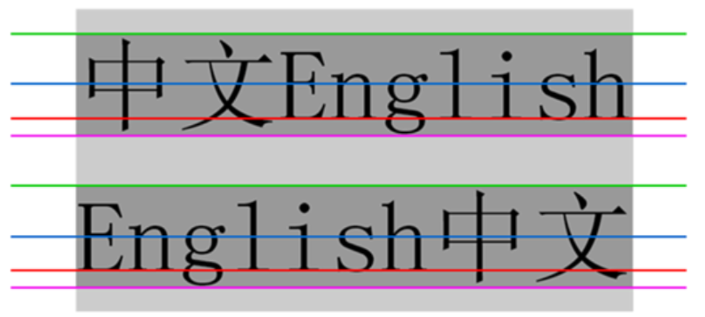

# 常用元素属性

## 一、字体属性

### 1.设置字体

```css
body {
    font-family: '微软雅黑';
    font-family: 'Microsoft YaHei';
}
```

- 字体名称可以是中文，但是不建议
- 多个字体之间用逗号分隔（从左到右查找字体，如果都找不到，会使用默认字体）
- 如果字体名称有空格，使用引号包裹
- 建议使用常用字体，否则兼容性不好

### 2.大小

```css
p {
    font-size: 20px;
}
```

- 不同浏览器的默认字号不一样，最好给一个明确值
- 可以给 body 标签使用 font-size
- 要注意单位 px 不要忘记
- 标题标签需要单独指定大小

> 实际上它设置的是字体中字符框的高度，实际的字符字形可能比这些框高或者矮

### 3.粗细

```css
p {
    font-weight: bold;
    font-weight:700;
}
```

- 可以使用数字表示粗细
- 700 等同于 bold，400 是不变粗，等同于 normal
- 取值范围是[100, 900]

### 4.文字样式

```css
/* 设置倾斜 */
font-style: italic;
/* 取消倾斜 */
font-style: normal;
```

很少需要把某个文字变倾斜，但是经常要把 em 或 i 变成不倾斜

## 二、文本属性

### 1.文本颜色

#### 1.1 认识RGB

显示器是由很多很多的像素构成的，每个像素视为一个点，这个点就能反映出一个具体的颜色。我们使用 R，G，B 的方式表示颜色，三种颜色按照不同的比例搭配，就能混合出各种五彩斑斓的效果。

计算机中针对RGB分量，分别使用一个字节表示（8个比特位，表示范围是 0~255，十六进制表示为 00~FF）。数值越大，表示该分量的颜色越浓。

#### 1.2 设置文本颜色

```css
color: red;
color: #ff0000;
color: rgb(255, 0, 0)
```

color 属性值的写法：

- 预定义的颜色值（直接是单词）
- 十六进制形式
- RGB 方式

> 十六进制形式表示颜色，如果两两相同，就可以用一个来表示
>
> #ff00ff $\rightarrow$ #f0f

### 2.文本对齐

控制文本水平方向的对齐，还能控制图片等元素居中或者靠右。

```css
text-align: 值;
```

- center：居中对齐
- left：左对齐
- right：右对齐

### 3.文本装饰

```css
text-decoration: 值;
```

常用取值：

- underline：下划线
- none：啥都没有（可以给 a 标签去掉下划线）
- overline：上划线
- line-through：删除线

### 4.文本缩进

控制段落首行缩进

```css
text-indent: 值;
```

- 单位可以使用 px 或者 em
- 使用 em 作为单位更好，1个 em 就是当前元素的文字大小
- 缩进可以是负的，表示往左缩进（文字冒出去了）

### 5.行高

行高指的是上下文本行之间的基线距离，HTML中展示文字涉及到这几个基准线：

- 顶线
- 中线
- 基线
- 底线

内容区：底线和顶线包裹的区域，即下图深灰色背景区域。



而且 $\text{基线之间的距离} = \text{顶线间距离} = \text{底线间距离} = \text{中线间距离}$

```css
line-height: 值;
```

1. 上下边距是相等的，行高计算公式为：

   ```math
   \text{行高} = \text{上边距} + \text{下边距} + \text{字体大小}
   ```

2. 行高也可取 normal 等值

3. 行高等于元素高度，就可以实现文字居中对齐

   ```html
   <style>
       .line-height .two {
           height: 100px;
           line-height: 100px;
       }
   </style>
   
   <div class="line-height">
       <div class="two">
           文本垂直居中
       </div>
   </div>
   ```

## 三、背景属性

### 1.背景颜色

```html
<style>
    body {
        background-color: #f3f3f3;
    }
    
    .bgc .one {
        background-color: red;
    }
    
    .bgc .two {
        background-color: #0f0;
    }
    
    .bgc .three {
        /* 背景透明 */
        background-color: transparent;
    }
</style>

<div class="bgc">
    <div class="one">
        红色背景
    </div>
    <div class="two">
        绿色背景
    </div>
    <div>
        透明背景
    </div>
</div>
```

### 2.背景图片

```css
background-image: url(...);
```

比 image 更方便控制位置（图片在盒子中的位置）

> - url 可以是绝对路径，也可以是相对路径
> - url 上可以加引号，也可以不加

### 3.背景平铺

```css
background-repeat: 平铺方式;
```

重要取值：

- repeat：平铺（默认）
- no-repeat：不平铺
- repeat-x：水平平铺
- repeat-y：垂直平铺

> 背景颜色和背景图片可以同时存在，背景图片在背景颜色的上方

### 4.背景位置

```css
background-position: x y;
```

修改图片位置，参数有三种风格：

- 方位名词：top，left，right，bottom
- 精确单位：坐标或者百分比（以左上为原点）
- 混合单位：同时包含方位名词和精确单位

注意：

1. 如果参数的两个值都是方位名词，则前后顺序无关（例如：top left 和 left top 等效）。 
2. 如果只指定了一个方位名词，则第二个默认居中（例如：left 则意味着水平居中，top 意味着垂直居中）。 
3. 如果参数是精确值，则的第一个肯定是 x ，第二个肯定是 y （例如：100 200 意味着 x 为 100，y 为 200）。 
4. 如果参数是精确值，且只给了一个数值，则该数值一定是 x 坐标，另一个默认垂直居中。
5.  如果参数是混合单位，则第一个值一定为 x，第二个值为 y 坐标（例如：100 center 表示横坐标为 100，垂直居中）。

### 5.背景尺寸

```css
background-size: length|percentage|cover|contain;
```

1. 可以填具体的数值：如 40px 60px 表示宽度为 40px，高度为 60px。
2. percentage：按照父元素的尺寸设置。
3. cover：把背景图像扩展至足够大，以使背景图像完全覆盖背景区域。背景图像的某些部分也许无法显示在背景定位区域中。
4. contain：把图像扩展至最大尺寸，以使其宽度和高度完全适应内容区域。

[background-size值：cover、100%和contain的区别](https://blog.csdn.net/caicai1171523597/article/details/105876002)
