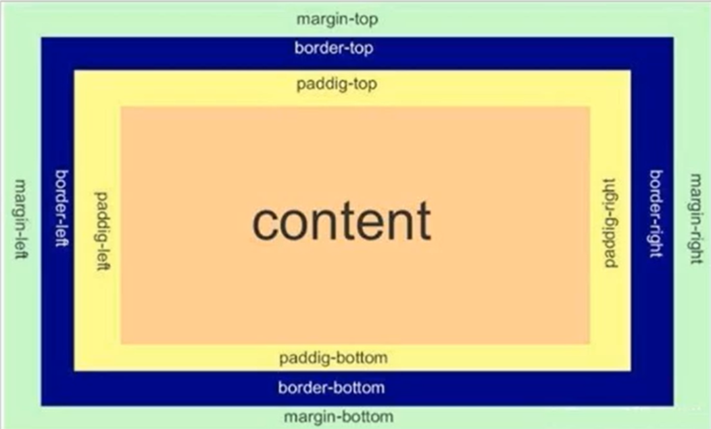

# 盒模型

每一个 HTML 元素就相当于是一个矩形的**盒子**，这个盒子由这几个部分构成：

- 边框：border
- 内容：content
- 内边距：padding
- 外边距：margin



## 一、边框

### 1.基础属性

- 粗细：border-width
- 样式：border-style
  - 默认没有边框
  - solid 实线边框
  - dashed 虚线边框
  - dotted 点线边框
- 颜色：border-color

```html
<style>
    div {
        width: 200px;
        height: 200px;
        border-width: 10px;
        border-style: solid;
        border-color: red;
    }
</style>
<div>ahwei</div>
```

支持简写，没有顺序要求：

```css
border: 10px solid red;
```

可以改四个方向的任意边框：

```css
border-top/bottom/left/right
```

只给上边框设置红色，其余蓝色：

```css
border: 1px solid blue;
border-top: red;
```

### 2.边框会撑大盒子

通过 box-sizing 属性可以修改浏览器的行为，使边框不再撑大盒子（`*` 为通配符选择器）

```css
* {
    box-sizing: border-box;
}
```

## 二、内边距

padding 设置内容和边框之间的距离

### 1.基础写法

四个方向都加上边框：

- padding-top
- padding-bottom
- padding-left
- padding-right

内边距也会撑大盒子，使用 `box-sizing: border-box` 属性也可以使内边距不再撑大盒子。

### 2.复合写法

可以把多个方向的 padding 合并到一起：

```css
padding: 5px; 表示四个方向都是 5px
padding: 5px 10px; 表示上下内边距 5px, 左右内边距为 10px
padding: 5px 10px 20px; 表示上边距 5px, 左右内边距为 10px, 下内边距为 20px
padding: 5px 10px 20px 30px; 表示 上5px, 右10px, 下20px, 左30px (顺时针)
```

## 三、外边距

### 1.基础写法

控制盒子和盒子之间的距离，可以给四个方向都加上边距：

- margin-top
- margin-bottom
- margin-left
- margin-right

### 2.复合写法

规则同 padding：

```css
margin: 10px; // 四个方向都设置
margin: 10px 20px; // 上下为 10, 左右 20
margin: 10px 20px 30px; // 上 10, 左右 20, 下 30
margin: 10px 20px 30px 40px; // 上 10, 右 20, 下 30, 左 40
```

### 3.块级元素水平居中

前提：

- 指定宽度（如果不指定宽度，默认和父元素一致）
- 把水平 margin 设为 auto

三种写法均可：

```css
margin-left: auto; margin-right: auto;
margin: auto;
margin: 0 auto;
```

> 这个水平居中方式和 text-align 不一样
>
> margin: auto 是给块级元素用得到
>
> text-align: center 是让行内元素或者行内块元素居中的

另外，对于垂直居中，不能使用上下 margin 为 auto 的方式

## 四、去除浏览器默认样式

浏览器会给元素加上一些默认样式，尤其是内外边距，不同的浏览器默认样式存在差别。

为了保证代码在不同的浏览器上都能按照统一的样式显示，往往会去除浏览器的默认样式，**这是需要用到通配符选择器**：

```css
* {
    margin: 0;
    padding: 0;
}
```

